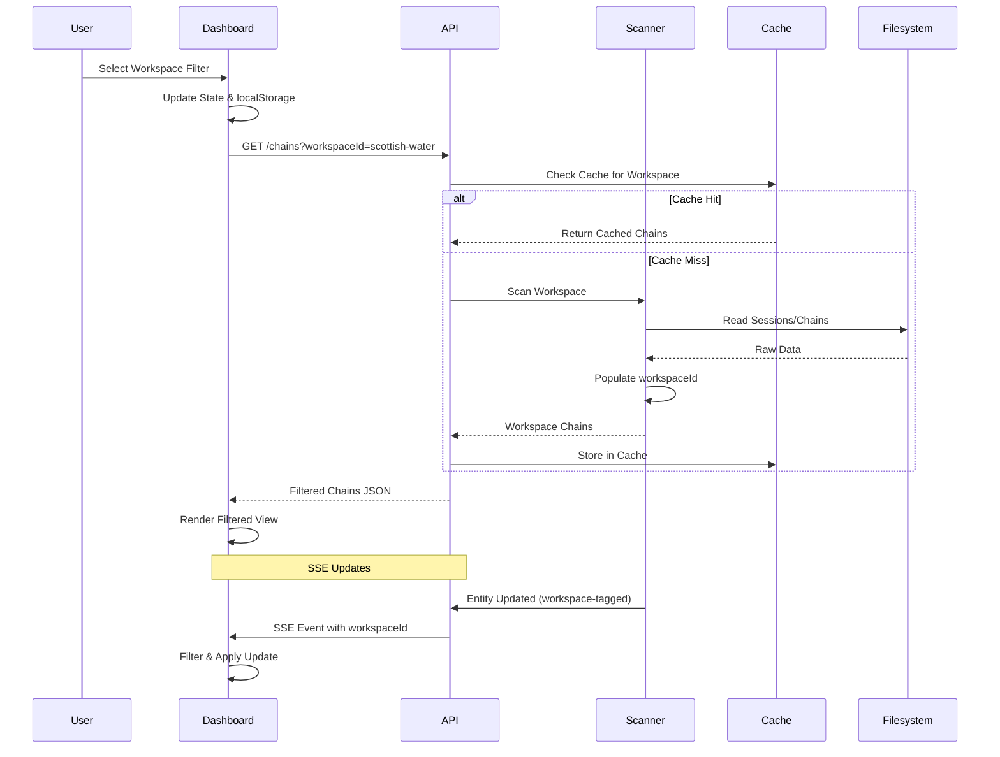

# Design Document: Multi-Workspace Monitoring

## Overview

This design transforms AgentHQ from a single-workspace monitoring tool into a multi-workspace monitoring hub. The feature enables simultaneous monitoring of multiple Kiro agent engagements/workspaces through a unified dashboard interface.

### Key Capabilities

- **Workspace Configuration**: JSON-based configuration defining multiple workspaces with unique identifiers and directory paths
- **Multi-Workspace Scanning**: Parallel scanning of sessions, chains, jobs, specs, and git status across all configured workspaces
- **Workspace-Identified Data**: All domain models enriched with workspace identification for filtering and attribution
- **Per-Workspace Caching**: Independent cache storage for each workspace to optimize rescanning performance
- **Filtered API Access**: Query parameter-based filtering on all data retrieval endpoints
- **Unified Dashboard**: Single-pane-of-glass view with workspace selector and aggregated metrics
- **Real-Time Updates**: SSE-based live updates with workspace identification for filtered subscriptions

### Design Goals

1. **Minimal Configuration Overhead**: Single JSON file with sensible defaults for optional paths
2. **Graceful Degradation**: Invalid workspaces log warnings but don't prevent monitoring of valid workspaces
3. **Performance**: Independent per-workspace caching ensures rescanning one workspace doesn't invalidate others
4. **Consistency**: All data models uniformly extended with workspaceId field
5. **User Experience**: Workspace filter persists across sessions and applies consistently to all views

## Architecture

### High-Level Architecture

```mermaid
graph TB
    subgraph Configuration Layer
        WC[workspaces.json]
        CL[Configuration Loader]
    end
    
    subgraph Scanning Layer
        MWS[Multi-Workspace Scanner]
        SC[Session Scanner]
        CC[Chain Scanner]
        JC[Job Scanner]
        SpecC[Spec Scanner]
        GC[Git Scanner]
    end
    
    subgraph Caching Layer
        PWC[Per-Workspace Cache]
        SC_Cache[Session Cache]
        CC_Cache[Chain Cache]
        JC_Cache[Job Cache]
        SpecC_Cache[Spec Cache]
    end
    
    subgraph API Layer
        ChainRoute[/api/chains]
        JobRoute[/api/jobs]
        SessionRoute[/api/sessions]
        GitRoute[/api/git]
        QueueRoute[/api/queue/status]
    end
    
    subgraph Dashboard Layer
        WF[Workspace Filter]
        DashView[Dashboard View]
        ActivityView[Activity View]
        WorkView[Work View]
        SSE[SSE Client]
    end
    
    subgraph Worker Layer
        QP[Queue Poller]
        SSEB[SSE Broadcaster]
    end
    
    WC -->|validates & loads| CL
    CL -->|provides workspace configs| MWS
    
    MWS -->|scans per workspace| SC
    MWS -->|scans per workspace| CC
    MWS -->|scans per workspace| JC
    MWS -->|scans per workspace| SpecC
    MWS -->|scans per workspace| GC
    
    SC <-->|reads/writes| SC_Cache
    CC <-->|reads/writes| CC_Cache
    JC <-->|reads/writes| JC_Cache
    SpecC <-->|reads/writes| SpecC_Cache
    
    PWC -->|manages| SC_Cache
    PWC -->|manages| CC_Cache
    PWC -->|manages| JC_Cache
    PWC -->|manages| SpecC_Cache
    
    MWS -->|aggregated data| ChainRoute
    MWS -->|aggregated data| JobRoute
    MWS -->|aggregated data| SessionRoute
    MWS -->|aggregated data| GitRoute
    
    ChainRoute -->|filtered by workspaceId| DashView
    JobRoute -->|filtered by workspaceId| WorkView
    SessionRoute -->|filtered by workspaceId| ActivityView
    GitRoute -->|filtered by workspaceId| DashView
    QueueRoute -->|filtered by workspaceId| DashView
    
    WF <-->|selection state| DashView
    WF <-->|selection state| ActivityView
    WF <-->|selection state| WorkView
    
    QP -->|processes per workspace| MWS
    SSEB -->|workspace-tagged events| SSE
    SSE -->|filters by selection| DashView
```

### Component Responsibilities

#### Configuration Layer
- **workspaces.json**: JSON file defining workspace array with identifiers, paths, and optional queue configurations
- **Configuration Loader**: Validates schema, checks path existence, enforces uniqueness constraints, applies defaults

#### Scanning Layer
- **Multi-Workspace Scanner**: Orchestrates parallel scanning across all configured workspaces
- **Per-Scanner Modules**: Session, Chain, Job, Spec, and Git scanners adapted to accept workspace context

#### Caching Layer
- **Per-Workspace Cache**: Keyed cache storage structure maintaining separate cache entries per workspace identifier
- **Cache Invalidation**: Workspace-scoped invalidation ensuring surgical cache updates

#### API Layer
- **Route Handlers**: Accept optional `workspaceId` query parameter for filtering
- **Response Handling**: Return 404 for invalid workspace IDs, empty arrays for valid workspaces with no data, full datasets when filter omitted


#### Dashboard Layer
- **Workspace Filter**: Dropdown control with "All Workspaces" and per-workspace options
- **View Components**: Dashboard, Activity, and Work views applying workspace filter consistently
- **SSE Client**: Filters incoming events based on selected workspace

#### Worker Layer
- **Queue Poller**: Loads and processes queue files from workspace-specific paths
- **SSE Broadcaster**: Tags all emitted events with workspace identifier

## Components and Interfaces

### Configuration Module

#### WorkspaceConfig Interface

```typescript
export interface WorkspaceConfig {
  /** Unique workspace identifier (lowercase alphanumeric and hyphens, 1-50 chars) */
  id: string;
  
  /** Absolute path to job output directory */
  OUTPUT_DIR: string;
  
  /** Absolute path to sessions directory */
  SESSIONS_DIR: string;
  
  /** Absolute path to workspace root (for git operations) */
  WORKSPACE_ROOT: string;
  
  /** Optional: absolute path to chains directory (defaults to SESSIONS_DIR) */
  CHAINS_DIR?: string;
  
  /** Optional: absolute path to specs directory */
  SPECS_DIR?: string;
  
  /** Optional: absolute path to prompt output directory (defaults to OUTPUT_DIR) */
  PROMPT_OUTPUT_DIR?: string;
  
  /** Optional: relative path to crawl queue file (relative to WORKSPACE_ROOT) */
  CRAWL_JOBS_FILE?: string;
  
  /** Optional: relative path to clone queue file (relative to WORKSPACE_ROOT) */
  CLONE_JOBS_FILE?: string;
  
  /** Optional: relative path to build queue file (relative to WORKSPACE_ROOT) */
  BUILD_QUEUE_FILE?: string;
}
```

#### Configuration Loader

```typescript
export interface ConfigurationLoader {
  /**
   * Load and validate workspace configuration from workspaces.json
   * @returns Array of validated workspace configurations
   * @throws Error if file missing, malformed JSON, duplicate IDs, or >50 workspaces
   */
  loadWorkspaces(): Promise<WorkspaceConfig[]>;
  
  /**
   * Validate a single workspace configuration
   * @param config Workspace configuration to validate
   * @returns true if valid, logs warning and returns false if paths missing
   */
  validateWorkspace(config: WorkspaceConfig): Promise<boolean>;
  
  /**
   * Apply defaults for optional fields
   * @param config Workspace configuration with potential missing optional fields
   * @returns WorkspaceConfig with all fields populated
   */
  applyDefaults(config: WorkspaceConfig): WorkspaceConfig;
}
```

**Implementation Notes:**
- Validate workspace ID regex: `^[a-z0-9-]{1,50}$`
- Check uniqueness with case-sensitive comparison
- Enforce maximum 50 workspaces
- Use `fs.existsSync()` for path validation
- Log descriptive errors including workspace ID and failure reason
- Continue loading remaining workspaces after path validation warnings
- Exit with non-zero code for: missing file, malformed JSON, duplicate IDs, >50 workspaces, zero valid workspaces


### Data Models

#### Extended Domain Interfaces

All existing domain interfaces extended with `workspaceId` field:

```typescript
export interface Job {
  // ... existing fields ...
  workspaceId: string;
}

export interface SessionState {
  // ... existing fields ...
  workspaceId: string;
}

export interface Chain {
  // ... existing fields ...
  workspaceId: string;
}

export interface JobChain {
  // ... existing fields ...
  workspaceId: string;
}

export interface GitStatus {
  // ... existing fields ...
  workspaceId: string;
}

export interface BackgroundJobRecord {
  // ... existing fields ...
  workspaceId: string;
}

export interface BuildQueueRecord {
  // ... existing fields ...
  workspaceId: string;
}
```

**Population Strategy:**
- Scanner functions accept `workspaceId` parameter and populate field during object construction
- Fail entire workspace scan if workspace ID cannot be determined (missing metadata/corruption)
- All scanners return arrays where every element has `workspaceId` populated


### Multi-Workspace Scanner

```typescript
export interface MultiWorkspaceScanner {
  /**
   * Scan all configured workspaces and return aggregated data
   * @param workspaces Array of validated workspace configurations
   * @returns Aggregated scan results with workspace identification
   */
  scanAll(workspaces: WorkspaceConfig[]): Promise<{
    sessions: SessionState[];
    chains: Chain[];
    jobs: Job[];
    gitStatuses: GitStatus[];
  }>;
  
  /**
   * Scan a single workspace
   * @param workspace Workspace configuration
   * @returns Scan results for this workspace only
   */
  scanWorkspace(workspace: WorkspaceConfig): Promise<{
    sessions: SessionState[];
    chains: Chain[];
    jobs: Job[];
    gitStatus: GitStatus | null;
  }>;
}
```

**Implementation Strategy:**
1. Iterate over workspace configurations
2. For each workspace, invoke existing scanner functions (scanSessions, scanChains, scanJobs) with workspace-specific paths
3. Pass `workspaceId` parameter to each scanner
4. Invoke git status scanner in workspace's WORKSPACE_ROOT
5. Catch errors per workspace, log warnings, continue to next workspace
6. Aggregate all results into unified collections
7. Return aggregated data sorted by relevant timestamp fields

**Performance Considerations:**
- Use `Promise.all()` for parallel workspace scanning where possible
- Maintain per-workspace caching to avoid rescanning unchanged workspaces
- Target <5 seconds total scan time for typical configurations (5-10 workspaces)


### Per-Workspace Cache

```typescript
export interface PerWorkspaceCache<T> {
  /**
   * Get cached data for a workspace
   * @param workspaceId Workspace identifier
   * @returns Cached data if valid, null if expired or not found
   */
  get(workspaceId: string): T | null;
  
  /**
   * Set cached data for a workspace
   * @param workspaceId Workspace identifier
   * @param data Data to cache
   */
  set(workspaceId: string, data: T): void;
  
  /**
   * Invalidate cache for a specific workspace
   * @param workspaceId Workspace identifier
   */
  invalidate(workspaceId: string): void;
  
  /**
   * Invalidate all workspace caches
   */
  invalidateAll(): void;
}

export interface CacheEntry<T> {
  data: T;
  timestamp: number;
}

export interface CacheManager {
  sessions: PerWorkspaceCache<SessionState[]>;
  chains: PerWorkspaceCache<Chain[]>;
  jobs: PerWorkspaceCache<Job[]>;
  specs: PerWorkspaceCache<Chain[]>;
}
```

**Cache Structure:**
```typescript
// Internal cache storage per domain type
const sessionsCacheMap = new Map<string, CacheEntry<SessionState[]>>();
const chainsCacheMap = new Map<string, CacheEntry<Chain[]>>();
const jobsCacheMap = new Map<string, CacheEntry<Job[]>>();
const specsCacheMap = new Map<string, CacheEntry<Chain[]>>();
```


**Implementation Notes:**
- Each cache type maintains a Map keyed by workspaceId
- Cache entries include timestamp for TTL validation
- Use existing `SCAN_CACHE_TTL` constant (5000ms) for per-workspace TTL
- Invalidation is workspace-scoped: invalidating "workspace-a" leaves "workspace-b" cache intact
- Cache lookup returns null for expired entries, triggering rescan
- Cache lookup returns null for non-existent workspace IDs (auto-rescan is optional)

### API Route Modifications

#### Route Handler Pattern

```typescript
// Example: /api/chains route with workspace filtering
router.get('/chains', async (req, _params) => {
  const url = new URL(req.url);
  const workspaceId = url.searchParams.get('workspaceId');
  
  const allChains = await scanChains(/* all workspaces */);
  
  if (workspaceId) {
    // Validate workspace exists
    const validWorkspaces = getLoadedWorkspaces();
    const exists = validWorkspaces.some(w => w.id === workspaceId);
    
    if (!exists) {
      return new Response(
        JSON.stringify({ error: `Workspace '${workspaceId}' does not exist` }),
        { status: 404, headers: { 'content-type': 'application/json' } }
      );
    }
    
    // Filter by exact case-sensitive match
    const filtered = allChains.filter(c => c.workspaceId === workspaceId);
    return new Response(JSON.stringify(filtered), {
      headers: { 'content-type': 'application/json', 'connection': 'close' }
    });
  }
  
  // No filter: return all
  return new Response(JSON.stringify(allChains), {
    headers: { 'content-type': 'application/json', 'connection': 'close' }
  });
});
```


**Routes to Modify:**
- `GET /chains` (Requirement 5.1-5.5)
- `GET /jobs` (Requirement 5.6-5.10)
- `GET /sessions` (Requirement 5.11-5.15)
- `GET /git-status` (Requirement 5.16-5.20)
- `GET /queue/status` (Requirement 8.6-8.7)

**Common Behavior:**
- Accept optional `workspaceId` query parameter
- Return 404 with error message for invalid workspace IDs
- Return empty array (200 status) for valid workspace with no data
- Return full dataset (200 status) when filter omitted
- Apply case-sensitive exact string matching

### Dashboard UI Components

#### Workspace Filter Component

```typescript
export interface WorkspaceFilterState {
  selectedWorkspaceId: string | null; // null = "All Workspaces"
  availableWorkspaces: { id: string; displayName: string }[];
}

export interface WorkspaceFilterComponent {
  /**
   * Render workspace selector dropdown
   * @param state Current filter state
   * @returns HTML string for filter control
   */
  render(state: WorkspaceFilterState): string;
  
  /**
   * Handle workspace selection change
   * @param workspaceId Selected workspace ID or null for "All"
   */
  onSelectionChange(workspaceId: string | null): void;
  
  /**
   * Persist selection to localStorage
   * @param workspaceId Workspace ID to persist
   */
  persistSelection(workspaceId: string | null): void;
  
  /**
   * Restore selection from localStorage
   * @returns Persisted workspace ID or null
   */
  restoreSelection(): string | null;
}
```


**UI Placement:**
- Located in navigation area, visible on all dashboard pages
- Dropdown with "All Workspaces" as first option
- Per-workspace options labeled with workspace display name (converted from kebab-case to Title Case)

**Interaction Flow:**
1. User selects workspace from dropdown
2. `onSelectionChange()` fires
3. Selection persisted to `localStorage` with key `"selectedWorkspaceId"`
4. All data views refetch with new `workspaceId` query parameter
5. SSE client filters incoming events by selected workspace

**Error Handling:**
- If `localStorage.setItem()` fails, log warning to console and continue
- If restored workspace ID not in available workspaces, default to "All Workspaces"

#### Dashboard View Modifications

```typescript
export interface WorkspaceMetrics {
  workspaceId: string;
  displayName: string;
  totalMessages: number;
  contextUsagePct: number;
  activeSessions: number;
  pendingQueueItems: number;
  hasAttentionItems: boolean; // unsummarised sessions or queue errors
}

export interface DashboardViewState {
  selectedWorkspaceId: string | null;
  workspaceMetrics: WorkspaceMetrics[];
  gitStatuses: GitStatus[];
}
```

**Workspace Comparison Table:**
- Displayed when "All Workspaces" selected
- Columns: Workspace, Messages, Context %, Active Sessions, Queue Items
- Sorted by activity level descending (primary: total messages, secondary: alphabetical)
- Highlight workspaces with attention items (unsummarised sessions, queue errors)


**Git Status Section:**
- When "All Workspaces" selected: display git status blocks for all workspaces with workspace labels
- When specific workspace selected: display git status for that workspace only
- Fallback to all workspaces if selection state inconsistent
- Non-git repositories display as clean with empty arrays

### Queue Management

#### Queue Poller Modifications

```typescript
export interface QueuePollerWorkspaceContext {
  workspaceId: string;
  workspaceRoot: string;
  crawlJobsFile: string;
  cloneJobsFile: string;
  buildQueueFile: string;
}

export interface QueuePoller {
  /**
   * Load queue files from all configured workspaces
   * @param workspaces Array of workspace contexts
   * @returns Aggregated queue entries with workspace identification
   */
  loadQueues(workspaces: QueuePollerWorkspaceContext[]): Promise<{
    crawlQueue: BackgroundJobRecord[];
    cloneQueue: BackgroundJobRecord[];
    buildQueue: BuildQueueRecord[];
  }>;
  
  /**
   * Process queue entry in the context of its owning workspace
   * @param entry Queue entry with workspaceId populated
   * @param workspace Workspace context for path resolution
   */
  processEntry(entry: BackgroundJobRecord | BuildQueueRecord, workspace: QueuePollerWorkspaceContext): Promise<void>;
}
```

**Implementation Strategy:**
1. Iterate over workspace contexts
2. Load queue files from workspace-specific paths (resolve relative paths against WORKSPACE_ROOT)
3. Parse queue entries and populate `workspaceId` field
4. Aggregate entries from all workspaces
5. When dispatching entries, resolve paths and execute in owning workspace context


### SSE Updates

#### SSE Payload Structure

```typescript
export interface SSEUpdateEvent {
  type: 'chain-update' | 'job-update' | 'session-update' | 'git-update';
  workspaceId: string;
  data: Chain | Job | SessionState | GitStatus;
}
```

**Broadcaster Modifications:**
```typescript
export interface SSEBroadcaster {
  /**
   * Emit update event with workspace identification
   * @param event Event with workspaceId and data payload
   */
  emit(event: SSEUpdateEvent): void;
}
```

**Client-Side Filtering:**
```typescript
// Dashboard SSE client
eventSource.addEventListener('message', (e) => {
  const event: SSEUpdateEvent = JSON.parse(e.data);
  const selectedWorkspace = getSelectedWorkspaceId();
  
  // Apply update based on filter
  if (selectedWorkspace === null) {
    // "All Workspaces": apply all updates
    applyUpdate(event);
  } else if (event.workspaceId === selectedWorkspace) {
    // Specific workspace: apply only matching updates
    applyUpdate(event);
  } else if (!event.workspaceId) {
    // Update without workspace ID: apply to current view
    applyUpdate(event);
  }
  // Otherwise: ignore update (different workspace)
});
```

**Update Event Requirements:**
- Chain updates include `workspaceId` (Requirement 11.3)
- Job updates include `workspaceId` (Requirement 11.4)
- Session updates include `workspaceId` (Requirement 11.5)
- Updates without `workspaceId` applied when specific workspace selected (Requirement 11.6)
- All updates applied when "All Workspaces" selected (Requirement 11.7)


## Data Models

### Workspace Configuration Schema

```json
{
  "workspaces": [
    {
      "id": "scottish-water",
      "OUTPUT_DIR": "C:\\repos\\scottish-water\\output",
      "SESSIONS_DIR": "C:\\repos\\scottish-water\\.kiro\\sessions",
      "WORKSPACE_ROOT": "C:\\repos\\scottish-water",
      "CHAINS_DIR": "C:\\repos\\scottish-water\\.kiro\\sessions",
      "SPECS_DIR": "C:\\repos\\scottish-water\\.kiro\\specs",
      "PROMPT_OUTPUT_DIR": "C:\\repos\\scottish-water\\output",
      "CRAWL_JOBS_FILE": "docs/reference/.crawl-queue.json",
      "CLONE_JOBS_FILE": "docs/reference/.clone-queue.json",
      "BUILD_QUEUE_FILE": "docs/reference/.build-queue.json"
    },
    {
      "id": "project-alpha",
      "OUTPUT_DIR": "C:\\repos\\project-alpha\\output",
      "SESSIONS_DIR": "C:\\repos\\project-alpha\\.kiro\\sessions",
      "WORKSPACE_ROOT": "C:\\repos\\project-alpha"
    }
  ]
}
```

**Validation Rules:**
- `id`: Required, regex `^[a-z0-9-]{1,50}$`, must be unique across all workspaces
- `OUTPUT_DIR`, `SESSIONS_DIR`, `WORKSPACE_ROOT`: Required absolute paths
- `CHAINS_DIR`: Optional, defaults to `SESSIONS_DIR`
- `SPECS_DIR`: Optional, no default
- `PROMPT_OUTPUT_DIR`: Optional, defaults to `OUTPUT_DIR`
- `CRAWL_JOBS_FILE`, `CLONE_JOBS_FILE`, `BUILD_QUEUE_FILE`: Optional relative paths (relative to `WORKSPACE_ROOT`)
- Maximum 50 workspaces in array


## Correctness Properties

*A property is a characteristic or behavior that should hold true across all valid executions of a system—essentially, a formal statement about what the system should do. Properties serve as the bridge between human-readable specifications and machine-verifiable correctness guarantees.*

**Property Reflection:**

After analyzing all acceptance criteria, several redundancies were identified and consolidated:

**Configuration Validation Properties:**
- Properties 1.10 and 1.11 (duplicate ID detection and error handling) combined into single property
- Properties 1.14 and 1.15 (max workspace limit) combined into single property
- Properties 1.3 and 9.2 (required field validation) are the same core requirement

**API Filtering Properties:**
- Properties 5.1-5.5, 5.6-5.10, 5.11-5.15, 5.16-5.20, and 8.6-8.7 all test the same filtering pattern across different routes - consolidated into unified filtering properties

**SSE Properties:**
- Properties 11.1-11.5 (SSE event structure) combined as they test the same requirement
- Properties 6.9 and 6.11 (localStorage persistence round-trip) combined

**Cache Properties:**
- Properties 4.5 and 4.7 (surgical invalidation) are duplicates

The following properties represent the unique, non-redundant validation requirements:

### Property 1: Configuration JSON Round-Trip Preservation

*For any* valid workspace configuration array (conforming to schema with valid IDs, required paths, and ≤50 workspaces), serializing to JSON then deserializing SHALL produce an equivalent configuration structure with all required fields present and all optional fields either present or defaulted correctly.

**Validates: Requirements 1.1, 1.5, 1.6**


### Property 2: Workspace ID Validation Correctness

*For any* string, validation SHALL accept it as a workspace ID if and only if it matches the regex pattern `^[a-z0-9-]{1,50}$`, ensuring only lowercase alphanumeric characters and hyphens are allowed with length between 1-50 characters.

**Validates: Requirements 1.2**

### Property 3: Required Field Enforcement

*For any* workspace configuration object, validation SHALL reject the configuration if any of OUTPUT_DIR, SESSIONS_DIR, or WORKSPACE_ROOT fields are missing or empty, and SHALL accept the configuration if all three required fields are present with non-empty string values.

**Validates: Requirements 1.3, 9.2**

### Property 4: Optional Field Acceptance

*For any* workspace configuration with all required fields present, validation SHALL accept the configuration regardless of whether optional fields (CHAINS_DIR, SPECS_DIR, PROMPT_OUTPUT_DIR, queue file paths) are present or omitted.

**Validates: Requirements 1.4, 1.7**

### Property 5: Workspace ID Uniqueness Enforcement

*For any* workspace configuration array, validation SHALL reject the array if it contains duplicate workspace IDs (by case-sensitive string comparison) and SHALL accept the array if all workspace IDs are unique, regardless of the order or content of other fields.

**Validates: Requirements 1.10, 1.11, 9.1**

### Property 6: Workspace Count Limit Enforcement

*For any* workspace configuration array, validation SHALL reject arrays with more than 50 workspaces and SHALL accept arrays with 0-50 workspaces (inclusive), regardless of the content or validity of individual workspace objects.

**Validates: Requirements 1.14, 1.15**


### Property 7: Scanner Invocation Completeness

*For any* set of N configured workspaces, the multi-workspace scanner SHALL invoke session, chain, job, spec, and git scanning exactly once per workspace, resulting in 5N total scanner invocations regardless of scan results or errors.

**Validates: Requirements 2.1, 2.2, 2.3, 2.4, 2.5**

### Property 8: Data Aggregation Preservation

*For any* set of per-workspace scan results (sessions, chains, jobs), aggregating the results SHALL produce a unified collection that contains all items from all workspaces, preserving each item's data and adding the correct workspaceId tag, with no items lost or duplicated during aggregation.

**Validates: Requirements 2.6**

### Property 9: Scan Error Isolation

*For any* workspace configuration set where some workspace scanners throw errors, the multi-workspace scanner SHALL complete scanning all workspaces, logging errors for failed workspaces while successfully returning results from workspaces that scanned without errors.

**Validates: Requirements 2.8**

### Property 10: Workspace ID Population Consistency

*For any* workspace and scan type (sessions, chains, jobs), all objects returned from scanning that workspace SHALL have their workspaceId field populated with the exact workspace identifier from the configuration, with no objects missing the workspaceId field or having an incorrect value.

**Validates: Requirements 3.6**

### Property 11: Cache Isolation Between Workspaces

*For any* two distinct workspace identifiers A and B, storing cache data for workspace A SHALL NOT modify the cache data or timestamps for workspace B, ensuring complete independence of per-workspace cache storage.

**Validates: Requirements 4.1, 4.2, 4.3, 4.4**


### Property 12: Surgical Cache Invalidation

*For any* workspace identifier and populated multi-workspace cache, invalidating the cache for that workspace SHALL clear only the cache entries for that workspace, leaving all other workspace cache entries (data and timestamps) completely unchanged.

**Validates: Requirements 4.5, 4.7**

### Property 13: Per-Workspace TTL Independence

*For any* two workspace cache entries stored at different times, TTL expiration SHALL be evaluated independently for each workspace based on its own storage timestamp, ensuring workspace A's cache can be valid while workspace B's cache is expired.

**Validates: Requirements 4.6**

### Property 14: Cache Invalidation of Non-Existent Workspace

*For any* workspace identifier that does not exist in the cache, calling invalidate for that identifier SHALL complete without errors and SHALL NOT modify any existing cached data for other workspaces.

**Validates: Requirements 4.9**

### Property 15: API Filtering Correctness

*For any* dataset (chains, jobs, sessions, git statuses) with items tagged with various workspaceId values, querying with a workspaceId filter SHALL return only items where the workspaceId field exactly matches the filter value (case-sensitive string comparison), and querying without a filter SHALL return all items regardless of workspaceId.

**Validates: Requirements 5.1, 5.2, 5.3, 5.5, 5.6, 5.7, 5.8, 5.10, 5.11, 5.12, 5.13, 5.15, 5.16, 5.17, 5.18, 5.20, 8.6, 8.7**

### Property 16: API Invalid Workspace Response

*For any* workspace identifier that does not match any configured workspace, querying any API route (/chains, /jobs, /sessions, /git, /queue/status) with that workspaceId filter SHALL return HTTP 404 status with an error message indicating the workspace does not exist.

**Validates: Requirements 5.4, 5.9, 5.14, 5.19**


### Property 17: API Empty Result for Valid Workspace

*For any* configured workspace identifier with no data of the queried type, querying an API route with that workspaceId filter SHALL return HTTP 200 status with an empty array, distinguishing between "workspace exists but has no data" (200, []) and "workspace does not exist" (404, error).

**Validates: Requirements 5.4.1, 5.9.1, 5.14.1, 5.19.1**

### Property 18: Dashboard Filtering Logic Consistency

*For any* selected workspace identifier and dataset (chains, jobs, sessions, git statuses), applying the dashboard filtering logic SHALL include an item in the filtered view if and only if either (1) "All Workspaces" is selected OR (2) the item's workspaceId matches the selected workspace identifier.

**Validates: Requirements 6.4, 6.5, 6.6, 6.7**

### Property 19: Workspace Selection Persistence Round-Trip

*For any* valid workspace identifier or null (representing "All Workspaces"), persisting the selection to localStorage then immediately reading it back SHALL return the same value, ensuring reliable persistence of user's workspace filter selection across page reloads.

**Validates: Requirements 6.9, 6.11**

### Property 20: Workspace Selection Fallback Behavior

*For any* workspace identifier stored in localStorage that does not match any configured workspace identifier, restoring the selection SHALL default to "All Workspaces" (null), preventing errors from stale or invalid persisted selections.

**Validates: Requirements 6.10**

### Property 21: Queue Entry Workspace Identification

*For any* queue entry (crawl, clone, build) dispatched by the queue poller, the entry SHALL have its workspaceId field populated with the identifier of the workspace from which the queue file was loaded, ensuring all queued work is correctly attributed to its source workspace.

**Validates: Requirements 8.5**


### Property 22: Configuration Validation Order

*For any* configuration file content (valid or invalid), schema validation SHALL execute before any file operations, path checks, or workspace loading occurs, ensuring validation failures are detected early without side effects.

**Validates: Requirements 9.6**

### Property 23: Validation Error Message Completeness

*For any* workspace configuration that fails validation, the error message SHALL include both the workspace identifier (if parseable) and a description of the specific validation failure (duplicate ID, missing field, invalid format, etc.), providing developers with actionable diagnostic information.

**Validates: Requirements 9.7**

### Property 24: Workspace Metrics Calculation Correctness

*For any* set of sessions, jobs, and queue entries for a workspace, calculating workspace metrics SHALL produce counts and percentages that accurately reflect the data: total messages = sum of all session messages, context usage % = average of session context percentages, active sessions = count of sessions with status "active", pending queue items = count of queue entries with status "pending".

**Validates: Requirements 10.1, 10.2, 10.3, 10.4**

### Property 25: Workspace Comparison Sort Correctness

*For any* set of workspace metrics, sorting by activity level SHALL produce descending order based on total messages as primary key, and for workspaces with equal total messages, SHALL apply a deterministic secondary sort criteria (alphabetical by workspace ID or chronological by creation date) to ensure consistent ordering.

**Validates: Requirements 10.6, 10.6.1**

### Property 26: Attention Item Detection

*For any* workspace with sessions where (messageCount - lastSummarisedMessageCount) > 0 OR queue entries with status "error", the workspace SHALL be flagged as having attention items, and workspaces without such conditions SHALL NOT be flagged, regardless of other metrics.

**Validates: Requirements 10.7**


### Property 27: SSE Event Workspace Identification

*For any* entity update event (chain, job, session, git status) emitted by the SSE broadcaster, the event payload SHALL include the workspaceId field populated with the workspace identifier of the entity being updated, enabling client-side filtering of real-time updates.

**Validates: Requirements 11.1, 11.2, 11.3, 11.4, 11.5**

### Property 28: SSE Client Filtering with Selected Workspace

*For any* incoming SSE update event and selected workspace identifier (not "All"), the dashboard SHALL apply the update to the displayed data if and only if (1) the event's workspaceId matches the selected workspace OR (2) the event has no workspaceId field, ensuring users see only relevant updates for their filtered view.

**Validates: Requirements 11.6, 11.6.1**

### Property 29: SSE Client Filtering with "All Workspaces"

*For any* incoming SSE update event when "All Workspaces" is selected, the dashboard SHALL apply the update to the displayed data regardless of whether the event has a workspaceId field or what value it contains, ensuring users see all activity across all workspaces in unfiltered view.

**Validates: Requirements 11.7**

## Error Handling

### Configuration Loading Errors

**Fatal Errors (exit with non-zero code):**
- Configuration file `workspaces.json` does not exist
- Configuration file contains malformed JSON (syntax errors)
- Duplicate workspace IDs detected
- Workspace array exceeds 50 entries
- Zero workspaces successfully loaded after validation

**Error Message Format:**
```
[AgentHQ Config] ERROR: {error_type}
  Workspace: {workspace_id}
  Detail: {specific_failure_reason}
  Action: {what_the_system_did}
```


**Warning-Level Errors (log and continue):**
- Required directory path does not exist on filesystem for a workspace
- Workspace scan fails due to file read errors or corruption
- Non-git workspace directories encountered during git scanning

**Warning Message Format:**
```
[AgentHQ Config] WARN: {warning_type}
  Workspace: {workspace_id}
  Detail: {specific_issue}
  Action: Skipping workspace, continuing with remaining workspaces
```

### API Error Responses

**404 Not Found:**
```json
{
  "error": "Workspace '{workspaceId}' does not exist"
}
```

**500 Internal Server Error:**
```json
{
  "error": "Failed to scan workspaces: {error_message}"
}
```

### UI Error Handling

**localStorage Failures:**
- Log warning to console: `[AgentHQ] Failed to persist workspace selection: {error}`
- Continue operation without persistence
- User selection remains active for current session but won't persist

**Invalid Restored Selection:**
- Silently default to "All Workspaces"
- Clear invalid value from localStorage
- No error message shown to user (graceful degradation)

**SSE Connection Failures:**
- Retry connection with exponential backoff
- Display connection status indicator in UI
- Fall back to periodic polling if SSE unavailable


## Testing Strategy

### Dual Testing Approach

This feature requires both **property-based testing** for correctness guarantees and **unit/integration testing** for specific scenarios and external interactions.

### Property-Based Testing

**Library Selection:** Use `fast-check` for TypeScript/JavaScript property-based testing

**Property Test Configuration:**
- Minimum 100 iterations per property test (due to randomization)
- Each property test tagged with comment referencing design property
- Tag format: `// Feature: multi-workspace-monitoring, Property {number}: {property_text}`

**Property Test Coverage:**

1. **Configuration Validation Properties (Properties 1-6)**
   - Generators: workspace config objects, workspace arrays, random strings, path strings
   - Test: validation logic, default application, uniqueness checks, count limits
   - Inputs: valid/invalid workspace IDs, missing/present fields, duplicate IDs, various array sizes

2. **Scanning Properties (Properties 7-10)**
   - Generators: workspace configs, mock scan results, error-throwing scanners
   - Test: scanner invocation counts, data aggregation, error isolation, workspaceId population
   - Inputs: varying workspace counts, mixed success/failure scan results

3. **Caching Properties (Properties 11-14)**
   - Generators: workspace IDs, cache data, timestamps
   - Test: cache isolation, surgical invalidation, independent TTL, non-existent key handling
   - Inputs: multiple workspace IDs, varying cache states, time advances

4. **API Filtering Properties (Properties 15-17)**
   - Generators: datasets with workspaceId tags, filter values, workspace configs
   - Test: filtering correctness, error responses, empty result handling
   - Inputs: various dataset sizes, valid/invalid workspace IDs, empty datasets

5. **Dashboard Properties (Properties 18-20)**
   - Generators: workspace selections, datasets, localStorage states
   - Test: filtering logic, selection persistence round-trip, fallback behavior
   - Inputs: "All" and specific workspace selections, stale localStorage values


6. **Queue Properties (Property 21)**
   - Generators: queue entries, workspace configs
   - Test: workspaceId population during dispatch
   - Inputs: crawl/clone/build queue entries from various workspaces

7. **Validation Properties (Properties 22-23)**
   - Generators: valid/invalid config content, various validation failures
   - Test: validation order, error message completeness
   - Inputs: schema violations, missing fields, duplicate IDs

8. **Metrics Properties (Properties 24-26)**
   - Generators: sessions with varying message counts, jobs, queue entries
   - Test: metric calculation, sort order, attention item detection
   - Inputs: various activity levels, equal metrics, sessions with unsummarised messages

9. **SSE Properties (Properties 27-29)**
   - Generators: entity update events, workspace selections
   - Test: event structure, client-side filtering
   - Inputs: events with/without workspaceId, "All" and specific workspace selections

### Unit and Integration Testing

**Unit Tests (Specific Examples and Edge Cases):**

1. **Configuration Loading**
   - Missing `workspaces.json` file: verify error and non-zero exit
   - Malformed JSON: verify parse error logged with JSON error details
   - Zero valid workspaces after validation: verify error and exit

2. **Path Validation**
   - Non-existent required paths: verify warning logged, workspace skipped, others loaded
   - Mix of valid/invalid workspace paths: verify partial loading succeeds

3. **Git Scanning**
   - Non-git directories: verify clean GitStatus returned
   - Git command failures: verify error handling and fallback behavior

4. **UI Components**
   - Workspace selector rendering: verify options include "All" + configured workspaces
   - localStorage.setItem failure: verify warning logged and operation continues
   - Inconsistent selection state: verify fallback to "All Workspaces"

5. **SSE Connection**
   - Connection failure: verify retry with exponential backoff
   - Connection drop: verify fallback to polling


**Integration Tests (External Dependencies and End-to-End Flows):**

1. **Filesystem Integration**
   - Create test directories matching workspace configs
   - Verify scanners correctly read from workspace-specific paths
   - Verify queue files loaded from workspace roots

2. **Git Integration**
   - Create test git repositories with various states (clean, modified, staged, untracked)
   - Verify git status scanner correctly interprets `git status --porcelain` output
   - Verify workspace-specific git operations execute in correct WORKSPACE_ROOT

3. **API Integration**
   - End-to-end API tests with real HTTP requests
   - Verify CORS, headers, response formats
   - Verify query parameter parsing and filtering

4. **Performance Testing**
   - Load 10-50 workspaces with realistic data volumes
   - Measure total scan time, verify <5 seconds
   - Measure cache hit rates and invalidation performance

5. **Dashboard Integration**
   - Browser-based tests with real localStorage
   - Verify workspace filter interaction updates all views
   - Verify SSE updates applied correctly based on filter

### Test Data Generators

**For Property-Based Tests:**

```typescript
// Workspace ID generator (valid and invalid)
const workspaceIdArb = fc.oneof(
  fc.stringMatching(/^[a-z0-9-]{1,50}$/),  // valid
  fc.string(),                              // invalid (any string)
);

// Workspace config generator
const workspaceConfigArb = fc.record({
  id: workspaceIdArb,
  OUTPUT_DIR: fc.string().filter(s => s.length > 0),
  SESSIONS_DIR: fc.string().filter(s => s.length > 0),
  WORKSPACE_ROOT: fc.string().filter(s => s.length > 0),
  CHAINS_DIR: fc.option(fc.string().filter(s => s.length > 0)),
  SPECS_DIR: fc.option(fc.string().filter(s => s.length > 0)),
  PROMPT_OUTPUT_DIR: fc.option(fc.string().filter(s => s.length > 0)),
});

// Workspace array generator
const workspacesArrayArb = fc.array(workspaceConfigArb, { minLength: 0, maxLength: 60 });

// Entity with workspaceId generator
const entityWithWorkspaceArb = <T>(entityArb: fc.Arbitrary<T>) =>
  fc.record({
    ...entityArb,
    workspaceId: fc.stringMatching(/^[a-z0-9-]{1,50}$/),
  });
```


### Test Organization

```
test/
├── unit/
│   ├── config-loader.test.ts         # Configuration validation unit tests
│   ├── workspace-cache.test.ts        # Per-workspace cache unit tests
│   ├── api-filtering.test.ts          # API filtering logic unit tests
│   └── dashboard-filter.test.ts       # Dashboard filtering logic unit tests
├── properties/
│   ├── config-validation.prop.test.ts # Properties 1-6
│   ├── scanning.prop.test.ts          # Properties 7-10
│   ├── caching.prop.test.ts           # Properties 11-14
│   ├── api-filtering.prop.test.ts     # Properties 15-17
│   ├── dashboard.prop.test.ts         # Properties 18-20
│   ├── queue.prop.test.ts             # Property 21
│   ├── validation.prop.test.ts        # Properties 22-23
│   ├── metrics.prop.test.ts           # Properties 24-26
│   └── sse.prop.test.ts               # Properties 27-29
└── integration/
    ├── filesystem.integration.test.ts # Filesystem path validation and scanning
    ├── git.integration.test.ts        # Git operations integration
    ├── api.integration.test.ts        # API end-to-end tests
    ├── performance.integration.test.ts # Performance benchmarks
    └── dashboard.integration.test.ts  # Browser-based dashboard tests
```

### Verification Strategy

**Pre-Commit Checks:**
1. Run all property-based tests (100 iterations each)
2. Run all unit tests
3. Run integration tests with test fixtures
4. Verify no TypeScript compilation errors

**CI/CD Pipeline:**
1. Run property-based tests with increased iterations (1000 each)
2. Run full integration test suite
3. Run performance benchmarks, fail if >5 second scan time
4. Generate coverage report, enforce >80% coverage for core logic

**Manual Testing:**
1. Test with real multi-workspace configuration (Scottish Water + other projects)
2. Verify UI interactions: workspace filter, git sections, comparison table
3. Test SSE updates with multiple workspaces active simultaneously
4. Verify localStorage persistence across browser sessions


## Implementation Plan

### Phase 1: Core Configuration and Data Models (Foundation)

**Goal:** Establish workspace configuration loading and extend data models

**Tasks:**
1. Create `WorkspaceConfig` interface and configuration loader module
2. Implement JSON schema validation with Zod or similar
3. Implement validation rules: regex, uniqueness, count limits, required fields
4. Extend all domain interfaces with `workspaceId` field in `types.ts`
5. Implement error handling and logging for configuration failures
6. Write property tests for Properties 1-6 (configuration validation)
7. Write unit tests for specific configuration error scenarios

**Deliverables:**
- `src/config/workspace-config.ts` - Configuration loader
- Updated `src/types.ts` - Extended interfaces
- `test/properties/config-validation.prop.test.ts`
- `test/unit/config-loader.test.ts`

**Acceptance Criteria:**
- Configuration loader validates all requirements 1.1-1.15
- All property tests pass with 100+ iterations
- Manual test with sample `workspaces.json` file succeeds

---

### Phase 2: Multi-Workspace Scanning Architecture

**Goal:** Implement parallel scanning across multiple workspaces

**Tasks:**
1. Refactor existing scanner functions to accept workspace context parameters
2. Implement `MultiWorkspaceScanner` orchestrator
3. Implement per-workspace cache manager with Map-based storage
4. Update `scanSessions`, `scanChains`, `scanJobs`, `scanSpecs` to populate `workspaceId`
5. Implement git status scanner for multiple workspaces
6. Write property tests for Properties 7-14 (scanning and caching)
7. Write integration tests for filesystem path handling

**Deliverables:**
- `src/scan/multi-workspace.ts` - Multi-workspace scanner
- `src/scan/workspace-cache.ts` - Per-workspace cache manager
- Updated scanner functions in `src/scan/` directory
- `test/properties/scanning.prop.test.ts`
- `test/properties/caching.prop.test.ts`
- `test/integration/filesystem.integration.test.ts`

**Acceptance Criteria:**
- Multi-workspace scanner aggregates data from all configured workspaces
- Cache isolation verified: invalidating one workspace doesn't affect others
- Performance target met: <5 seconds for 10 workspaces
- All property tests pass with 100+ iterations


---

### Phase 3: API Layer Modifications

**Goal:** Add workspace filtering to all API routes

**Tasks:**
1. Update `/api/chains` route to accept `workspaceId` query parameter
2. Update `/api/jobs` route with workspace filtering
3. Update `/api/sessions` route with workspace filtering
4. Update `/api/git-status` route with workspace filtering (rename to `/api/git`)
5. Update `/api/queue/status` route with workspace filtering
6. Implement common filtering helper function
7. Implement validation: 404 for invalid workspace IDs, empty array for valid with no data
8. Write property tests for Properties 15-17 (API filtering)
9. Write integration tests for API endpoints

**Deliverables:**
- Updated route handlers in `src/routes/` directory
- `src/routes/helpers/filter.ts` - Common filtering utility
- `test/properties/api-filtering.prop.test.ts`
- `test/integration/api.integration.test.ts`

**Acceptance Criteria:**
- All routes accept optional `workspaceId` query parameter
- Filtering returns only matching items (case-sensitive exact match)
- Invalid workspace IDs return 404 with error message
- Valid workspace IDs with no data return 200 with empty array
- Omitted filter returns all data
- All property tests pass with 100+ iterations

---

### Phase 4: Dashboard UI Updates

**Goal:** Implement workspace filter control and update all views

**Tasks:**
1. Create workspace filter component in navigation area
2. Implement workspace selection state management
3. Implement localStorage persistence for selected workspace
4. Update Dashboard view to show workspace comparison table when "All" selected
5. Update Activity view to filter by selected workspace
6. Update Work view to filter by selected workspace
7. Update Git section to display per-workspace or all workspace status
8. Implement workspace metrics calculation
9. Write property tests for Properties 18-20, 24-26 (dashboard and metrics)
10. Write integration tests for browser interactions

**Deliverables:**
- `src/dashboard/components/workspaceFilter.ts` - Workspace filter component
- Updated view files in `src/dashboard/pages/`
- Updated `src/dashboard/state.ts` - State management
- `test/properties/dashboard.prop.test.ts`
- `test/properties/metrics.prop.test.ts`
- `test/integration/dashboard.integration.test.ts`

**Acceptance Criteria:**
- Workspace filter displays "All" + all configured workspaces
- Selection persists across page reloads via localStorage
- All views filter data correctly based on selection
- Workspace comparison table sorts by activity descending
- Git section shows all workspaces when "All" selected, single when filtered
- All property tests pass with 100+ iterations


---

### Phase 5: Queue Management and SSE Updates

**Goal:** Extend queue poller and SSE broadcaster for multi-workspace support

**Tasks:**
1. Update queue poller to load queue files from all workspace roots
2. Implement workspace context resolution for queue entry dispatch
3. Populate `workspaceId` field for all queue entries
4. Update SSE broadcaster to include `workspaceId` in all events
5. Implement client-side SSE filtering based on selected workspace
6. Write property tests for Properties 21, 27-29 (queue and SSE)
7. Write unit tests for queue poller modifications

**Deliverables:**
- Updated `src/workers/queuePoller.ts`
- Updated `src/workers/ssebroadcaster.ts`
- Updated SSE client in `src/dashboard/main.ts`
- `test/properties/queue.prop.test.ts`
- `test/properties/sse.prop.test.ts`
- `test/unit/queue-poller.test.ts`

**Acceptance Criteria:**
- Queue poller loads files from workspace-specific paths
- All dispatched queue entries have `workspaceId` populated
- SSE events include `workspaceId` field
- Dashboard applies SSE updates only for selected workspace (or all when "All" selected)
- Events without `workspaceId` applied when specific workspace selected
- All property tests pass with 100+ iterations

---

### Phase 6: Integration Testing and Documentation

**Goal:** Comprehensive testing with real workspaces and documentation

**Tasks:**
1. Create example `workspaces.json` configuration file
2. Set up test workspaces with realistic data
3. Run performance benchmarks with 10-50 workspaces
4. Verify all 29 correctness properties pass
5. Manual testing with real multi-workspace setup (Scottish Water + others)
6. Write user documentation for workspace configuration
7. Update README with multi-workspace setup instructions
8. Create migration guide for single-workspace users

**Deliverables:**
- `workspaces.json.example` - Example configuration
- `test/integration/performance.integration.test.ts`
- `docs/multi-workspace-setup.md` - User documentation
- Updated `README.md`
- `docs/migration-guide.md`

**Acceptance Criteria:**
- All 29 correctness properties pass with 1000+ iterations in CI
- Performance benchmarks meet <5 second target
- Manual testing confirms all features work end-to-end
- Documentation complete and reviewed
- Migration guide tested with real single-workspace instance


## Migration Strategy

### For Existing Single-Workspace Users

**Current Setup:**
```
# Environment variables in .env
OUTPUT_DIR=C:\repos\project\.output
SESSIONS_DIR=C:\repos\project\.kiro\sessions
WORKSPACE_ROOT=C:\repos\project
```

**Migration Path:**

1. **Create `workspaces.json` configuration:**
```json
{
  "workspaces": [
    {
      "id": "my-project",
      "OUTPUT_DIR": "C:\\repos\\project\\.output",
      "SESSIONS_DIR": "C:\\repos\\project\\.kiro\\sessions",
      "WORKSPACE_ROOT": "C:\\repos\\project"
    }
  ]
}
```

2. **Optional: Keep environment variables for backward compatibility**
   - Configuration loader checks for `workspaces.json` first
   - Falls back to environment variables if file not found
   - Logs warning encouraging migration to `workspaces.json`

3. **Verify migration:**
   - Start AgentHQ
   - Verify dashboard shows single workspace
   - Verify all existing functionality works unchanged

**No Breaking Changes:**
- Existing single-workspace setups continue working
- Data format unchanged (sessions, chains, jobs)
- Dashboard shows "All Workspaces" by default (which displays the single workspace)

### Adding Additional Workspaces

1. **Add workspace to configuration:**
```json
{
  "workspaces": [
    {
      "id": "my-project",
      "OUTPUT_DIR": "C:\\repos\\project\\.output",
      "SESSIONS_DIR": "C:\\repos\\project\\.kiro\\sessions",
      "WORKSPACE_ROOT": "C:\\repos\\project"
    },
    {
      "id": "scottish-water",
      "OUTPUT_DIR": "C:\\repos\\scottish-water\\output",
      "SESSIONS_DIR": "C:\\repos\\scottish-water\\.kiro\\sessions",
      "WORKSPACE_ROOT": "C:\\repos\\scottish-water",
      "SPECS_DIR": "C:\\repos\\scottish-water\\.kiro\\specs"
    }
  ]
}
```

2. **Restart AgentHQ**
3. **Select workspace from filter dropdown**
4. **View aggregated metrics in comparison table**


## Security Considerations

### Configuration File Security

**Risk:** Malicious configuration file with path traversal or command injection
**Mitigation:**
- Validate all paths are absolute (no relative paths for required directories)
- Reject configurations with path traversal sequences (`..`, symlinks)
- Queue file paths are relative to WORKSPACE_ROOT (contained)
- No execution of user-provided commands from configuration

### Workspace Isolation

**Risk:** Data leakage between workspaces
**Mitigation:**
- All file operations scoped to workspace-specific paths
- Cache keyed by workspace ID, no cross-workspace cache access
- API filtering enforces workspace boundaries
- Git operations execute in workspace-specific WORKSPACE_ROOT

### API Security

**Risk:** Unauthorized access to workspace data
**Mitigation:**
- AgentHQ runs on localhost only (not exposed externally)
- No authentication required (local development tool)
- Rate limiting on API endpoints to prevent DoS
- Input validation on all query parameters

### localStorage Security

**Risk:** XSS attacks through persisted workspace selection
**Mitigation:**
- Workspace IDs validated against regex before persistence
- Restored IDs validated against configured workspaces
- Fallback to safe default ("All") if invalid ID found
- No eval() or innerHTML usage in dashboard

### Git Operation Security

**Risk:** Command injection through git operations
**Mitigation:**
- Use `Bun.spawn()` with array arguments (no shell interpolation)
- WORKSPACE_ROOT validated as existing directory before git commands
- Git operations executed with explicit `cwd` parameter
- No user input passed directly to git commands


## Performance Optimization

### Caching Strategy

**Per-Workspace Cache Design:**
- Independent cache entries per workspace, keyed by workspace ID
- 5-second TTL (existing `SCAN_CACHE_TTL`)
- Surgical invalidation: only invalidate changed workspace
- Benefit: Rescanning one active workspace doesn't force rescan of 9 idle workspaces

**Cache Hit Rate Optimization:**
- Most workspaces idle most of the time
- Active workspace rescanned frequently, others served from cache
- Expected cache hit rate: 80-90% for typical usage (1-2 active workspaces out of 10)

### Parallel Scanning

**Concurrent Workspace Scanning:**
```typescript
const results = await Promise.all(
  workspaces.map(ws => scanWorkspace(ws))
);
```

**Benefits:**
- 10 workspaces scanned in parallel vs sequentially
- Reduces total scan time from `10 × scan_time` to `max(scan_times)`
- Target: <5 seconds for 10 workspaces (vs 10+ seconds sequential)

**Considerations:**
- Filesystem I/O parallelism limited by disk
- Balance: don't overwhelm filesystem with 50 concurrent scans
- Implement semaphore for max concurrent scans (e.g., 10 at a time)

### API Response Optimization

**Filtering at Source:**
```typescript
// Efficient: filter during aggregation
const chainsForWorkspace = scanWorkspace(workspace);

// Inefficient: scan all, then filter
const allChains = scanAllWorkspaces();
const filtered = allChains.filter(c => c.workspaceId === filter);
```

**Implementation:** When `workspaceId` filter provided, scan only that workspace (not all)

### Dashboard Rendering Optimization

**Incremental SSE Updates:**
- Update only affected workspace data, not full dataset
- Workspace filter applied client-side before render
- Avoid re-rendering unaffected workspace sections

**Virtual Scrolling:**
- Use virtual scrolling for large workspace lists (50+ workspaces)
- Render only visible workspace rows in comparison table
- Reduces DOM nodes from O(n) to O(viewport_height)


## Future Enhancements

### Workspace Groups

**Concept:** Organize workspaces into logical groups (e.g., "Production Projects", "POCs", "Research")

**Benefits:**
- Filter by group instead of individual workspace
- Bulk operations on workspace groups
- Hierarchical view in dashboard

**Implementation:**
```json
{
  "groups": {
    "production": ["scottish-water", "client-a", "client-b"],
    "poc": ["prototype-1", "experiment-2"]
  },
  "workspaces": [ /* ... */ ]
}
```

### Workspace-Specific Configuration Profiles

**Concept:** Different scan intervals, cache TTLs, or feature flags per workspace

**Use Case:** High-priority workspace scanned every 1 second, others every 5 seconds

**Implementation:**
```json
{
  "id": "critical-project",
  "OUTPUT_DIR": "...",
  "config": {
    "scanInterval": 1000,
    "cacheTTL": 500,
    "enableSSE": true
  }
}
```

### Workspace Activity Notifications

**Concept:** Desktop notifications when workspace attention items exceed threshold

**Triggers:**
- Unsummarised messages > 50
- Queue errors > 5
- Session rate-limited

**Implementation:** Electron notification API or browser Notification API

### Cross-Workspace Search

**Concept:** Global search across all workspace sessions, chains, and jobs

**Features:**
- Search by message content, user prompt, agent response
- Filter results by workspace, date range, status
- Jump to specific session/chain from search results

**Implementation:** Build inverted index of all content, update incrementally via SSE


### Workspace Metrics Dashboard

**Concept:** Dedicated view for comparing workspace metrics over time

**Metrics:**
- Message volume trends (last 7 days)
- Context usage patterns (average, peak)
- Active hours heatmap
- Job success/failure rates
- Queue processing times

**Visualization:** Charts using Chart.js or similar library

### Workspace Export/Import

**Concept:** Export workspace configuration and optionally data for sharing or backup

**Export Format:**
```json
{
  "workspace": { /* workspace config */ },
  "data": {
    "chains": [ /* ... */ ],
    "jobs": [ /* ... */ ],
    "sessions": [ /* ... */ ]
  }
}
```

**Use Cases:**
- Share workspace snapshot with team
- Backup before major changes
- Template workspace configs for new projects

## Appendix

### Workspace Configuration Complete Example

```json
{
  "workspaces": [
    {
      "id": "scottish-water",
      "OUTPUT_DIR": "C:\\Users\\User\\OneDrive - PBT Group\\Repos\\ScottishWater\\output",
      "SESSIONS_DIR": "C:\\Users\\User\\OneDrive - PBT Group\\Repos\\ScottishWater\\.kiro\\sessions",
      "WORKSPACE_ROOT": "C:\\Users\\User\\OneDrive - PBT Group\\Repos\\ScottishWater",
      "CHAINS_DIR": "C:\\Users\\User\\OneDrive - PBT Group\\Repos\\ScottishWater\\.kiro\\sessions",
      "SPECS_DIR": "C:\\Users\\User\\OneDrive - PBT Group\\Repos\\ScottishWater\\.kiro\\specs",
      "PROMPT_OUTPUT_DIR": "C:\\Users\\User\\OneDrive - PBT Group\\Repos\\ScottishWater\\output",
      "CRAWL_JOBS_FILE": "docs/reference/.crawl-queue.json",
      "CLONE_JOBS_FILE": "docs/reference/.clone-queue.json",
      "BUILD_QUEUE_FILE": "docs/reference/.build-queue.json"
    },
    {
      "id": "agenthq-development",
      "OUTPUT_DIR": "C:\\repos\\agenthq\\output",
      "SESSIONS_DIR": "C:\\repos\\agenthq\\.kiro\\sessions",
      "WORKSPACE_ROOT": "C:\\repos\\agenthq"
    },
    {
      "id": "research-project",
      "OUTPUT_DIR": "C:\\research\\project-alpha\\output",
      "SESSIONS_DIR": "C:\\research\\project-alpha\\.sessions",
      "WORKSPACE_ROOT": "C:\\research\\project-alpha",
      "SPECS_DIR": "C:\\research\\project-alpha\\.specs"
    }
  ]
}
```


### API Route Summary

| Route | Method | Query Params | Response | Description |
|-------|--------|--------------|----------|-------------|
| `/api/chains` | GET | `workspaceId` (optional) | `Chain[]` | Filtered or all chains |
| `/api/jobs` | GET | `workspaceId` (optional) | `Job[]` | Filtered or all jobs |
| `/api/sessions` | GET | `workspaceId` (optional) | `SessionState[]` | Filtered or all sessions |
| `/api/git` | GET | `workspaceId` (optional) | `GitStatus[]` | Filtered or all git statuses |
| `/api/queue/status` | GET | `workspaceId` (optional) | `QueueStatus` | Filtered or all queue data |
| `/api/chain-detail/:chainId` | GET | - | `ChainDetail` | Full session timeline for chain |
| `/api/job-chains` | GET | `workspaceId` (optional) | `JobChain[]` | Grouped job runs |

**Filter Behavior:**
- `workspaceId=<valid-id>`: Returns only items matching workspace (200 + data or 200 + [])
- `workspaceId=<invalid-id>`: Returns 404 + error message
- No filter: Returns all items across all workspaces (200 + data)

### Dashboard UI Component Hierarchy

```
Dashboard Root
├── Navigation
│   ├── Workspace Filter Dropdown
│   │   ├── "All Workspaces" Option
│   │   └── Workspace Options (dynamic)
│   └── View Navigation (Dashboard/Activity/Work)
├── Dashboard View (when "All Workspaces" selected)
│   ├── Workspace Comparison Table
│   │   ├── Workspace Name Column
│   │   ├── Total Messages Column
│   │   ├── Context Usage % Column
│   │   ├── Active Sessions Column
│   │   └── Pending Queue Items Column
│   └── Multi-Workspace Git Status Section
│       └── Git Status Block (per workspace)
├── Dashboard View (when specific workspace selected)
│   ├── Single Workspace Metrics
│   └── Workspace-Specific Git Status Section
├── Activity View
│   ├── Filtered Sessions List
│   └── Session Details Drawer
└── Work View
    ├── Filtered Jobs List
    ├── Job Chains List
    └── Queue Status Section
```

### Data Flow Diagram



---

## Conclusion

This design establishes a comprehensive multi-workspace monitoring architecture for AgentHQ, transforming it from a single-engagement tool into a unified monitoring hub. The key design principles—per-workspace caching, graceful degradation, consistent data models, and property-based correctness guarantees—ensure the system is both performant and reliable.

The phased implementation plan provides a clear path from foundation (configuration and data models) through core functionality (scanning and APIs) to user-facing features (dashboard and SSE), with comprehensive testing at each stage. The 29 correctness properties provide formal verification of critical behaviors, complemented by unit and integration tests for specific scenarios and external dependencies.

The migration strategy ensures existing single-workspace users can adopt multi-workspace features incrementally, while the future enhancements section charts a path toward advanced features like workspace groups, activity notifications, and cross-workspace search.

