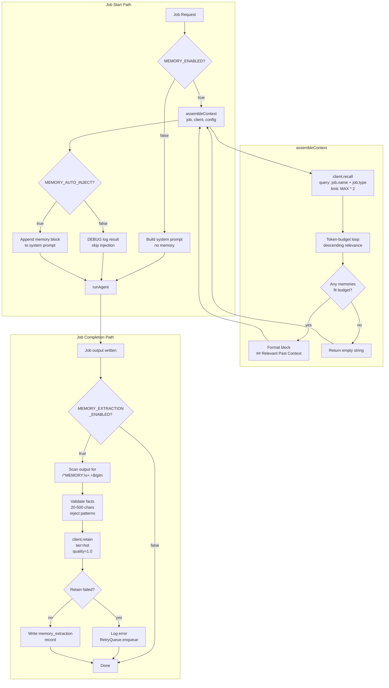
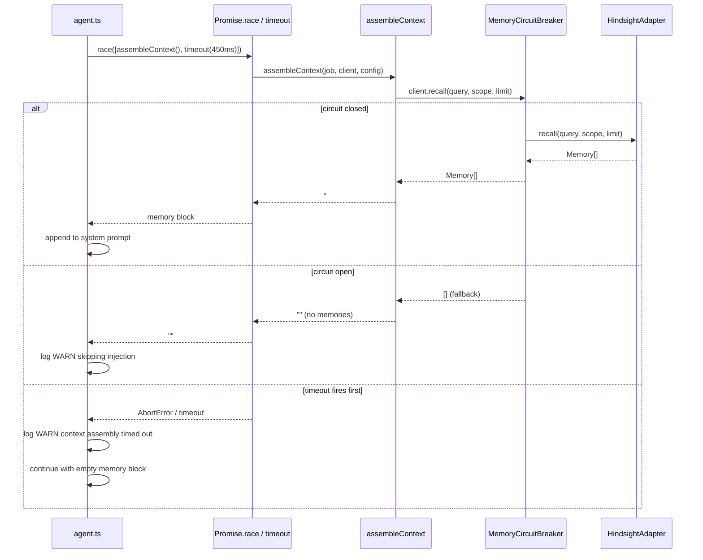

# Design Document

## Overview

Phase 6.3 — Context Assembly connects the Phase 6.2 memory infrastructure to the live agent
execution path. Two integration points are added:

1. **Pre-job context injection**: `assembleContext()` in `src/memory/assembly.ts` recalls
   relevant memories, applies a configurable token budget, and formats a `## Relevant Past Context`
   block that is prepended to the agent system prompt. A 450 ms timeout guard in `src/agent.ts`
   prevents memory latency from blocking job startup.

2. **Post-job marker extraction**: after a job finishes, `src/routes/jobs.ts` scans the agent
   output for `MEMORY: <fact>` lines, validates each fact against the existing Phase 6.2 rules,
   and stores passing facts via `client.retain()` with `tier = 'hot'` and `quality_score = 1.0`.

A read-only diagnostic endpoint (`POST /api/memory/inject-test`) lets developers inspect exactly
which memories would be injected for any existing job without triggering any storage side-effects.

The entire feature is gated by `MEMORY_ENABLED`. A secondary flag, `MEMORY_AUTO_INJECT`, controls
whether the assembled context is appended to the prompt (`true`) or merely logged at DEBUG (`false`).

---

## Architecture

### Component Interaction Diagram



### Caller Flow: assembleContext with Timeout Guard



### New / Modified Files

| File | Change |
|------|--------|
| `src/memory/assembly.ts` | **NEW** — `assembleContext`, `ReadOnlyMemoryClient`, `MemoryAssemblyConfig` |
| `src/agent.ts` | **MODIFIED** — call `assembleContext` with 450 ms guard before building system prompt |
| `src/routes/jobs.ts` | **MODIFIED** — MEMORY marker extraction after job completion |
| `src/routes/memory.ts` | **MODIFIED** — add `POST /api/memory/inject-test` |

No new dependencies are introduced. `fast-check` is already available for property-based tests.

---

## Components and Interfaces

### `MemoryAssemblyConfig` (src/memory/assembly.ts)

```typescript
export type MemoryAssemblyConfig = {
  /** Candidate recall limit; pass MEMORY_MAX_CONTEXT_MEMORIES * 2. */
  candidateLimit: number;
  /** Maximum tokens the returned block may consume (inclusive). */
  tokenBudget: number;
};
```

The 450 ms timeout is enforced at the call site in `agent.ts` via `Promise.race`, not inside
`assembleContext`. This keeps `assembleContext` a pure async function that is easier to test.

### `assembleContext` (src/memory/assembly.ts)

```typescript
export async function assembleContext(
  job: Job,
  client: IMemoryClient,
  config: MemoryAssemblyConfig,
): Promise<string>
```

Algorithm:

1. Build query string: `"${job.name} ${job.type}"`.
2. Build scope: `scopeFromJob(job)`.
3. Call `client.recall(query, scope, config.candidateLimit)`.
4. Count heading tokens: `countTokens("## Relevant Past Context\n")` → deduct from budget.
5. Iterate memories in the order returned (descending relevance from Hindsight):
   - Compute `countTokens("- " + memory.text + "\n")`.
   - If running total + line tokens ≤ remaining budget → include.
   - Otherwise → skip (count as dropped).
6. If zero lines included → return `""`.
7. If dropped > 0 → `console.debug("assembleContext: dropped N memories over token budget")`.
8. Return `"## Relevant Past Context\n" + lines.join("")` with **no trailing newline** on the
   final bullet.

Token counting helper (module-private):

```typescript
function countTokens(text: string): number {
  return Math.ceil(text.length / 4);
}
```

### `ReadOnlyMemoryClient` (src/memory/assembly.ts, exported)

```typescript
export class ReadOnlyMemoryClient implements IMemoryClient {
  readonly #inner: IMemoryClient;

  constructor(inner: IMemoryClient) { this.#inner = inner; }

  recall(query: string, scope: MemoryScope, limit: number): Promise<Memory[]> {
    return this.#inner.recall(query, scope, limit);
  }

  reflect(topic: string, scope: MemoryScope): Promise<string | null> {
    return this.#inner.reflect(topic, scope);
  }

  retain(_text: string, _scope: MemoryScope): Promise<string> {
    return Promise.reject(new MemoryClientError(
      'ReadOnlyMemoryClient: retain is not permitted in diagnostic mode',
      { method: 'retain' },
    ));
  }

  delete(_id: string): Promise<void> {
    return Promise.reject(new MemoryClientError(
      'ReadOnlyMemoryClient: delete is not permitted in diagnostic mode',
      { method: 'delete' },
    ));
  }
}
```

### `agent.ts` integration

The existing `runAgent` function accepts `config.systemPrompt`. The modification adds a
pre-prompt assembly step:

```typescript
// Conceptual — exact integration depends on call site
async function buildPromptWithMemory(
  config: AgentConfig,
  job: Job,
  memoryClient: IMemoryClient,
): Promise<string> {
  if (!MEMORY_ENABLED) return config.systemPrompt;

  const assemblyConfig: MemoryAssemblyConfig = {
    candidateLimit: MEMORY_MAX_CONTEXT_MEMORIES * 2,
    tokenBudget: MEMORY_CONTEXT_TOKEN_BUDGET,
  };

  let memoryBlock = '';
  try {
    memoryBlock = await Promise.race([
      assembleContext(job, memoryClient, assemblyConfig),
      new Promise<string>((_, reject) =>
        setTimeout(() => reject(new Error('assembleContext timeout')), 450)
      ),
    ]);
  } catch (err) {
    console.warn('WARN: memory circuit open — skipping injection');
    memoryBlock = '';
  }

  if (!MEMORY_AUTO_INJECT) {
    console.debug('assembleContext result (not injected):', memoryBlock);
    return config.systemPrompt;
  }

  return memoryBlock
    ? `${config.systemPrompt}\n\n${memoryBlock}`
    : config.systemPrompt;
}
```

Key rules:
- `MEMORY_ENABLED=false` → return `config.systemPrompt` immediately, no call.
- `MEMORY_ENABLED=true && MEMORY_AUTO_INJECT=false` → call, log at DEBUG, return base prompt.
- `MEMORY_ENABLED=true && MEMORY_AUTO_INJECT=true` → call, append non-empty result, return augmented prompt.
- Circuit breaker open → `recall` returns `[]` → `assembleContext` returns `""` → skip append, log WARN.
- Timeout → abort, log WARN, return base prompt.

### MEMORY marker extraction (src/routes/jobs.ts)

Triggered after a job completion event. The scan is synchronous over the already-loaded output
string; the retain calls are fire-and-forget (errors caught, logged, queued).

```typescript
const MEMORY_MARKER_REGEX = /^MEMORY:\s*(.+)$/gim;

async function extractMarkersFromOutput(
  output: string,
  job: Job,
  client: IMemoryClient,
): Promise<void> {
  if (!MEMORY_EXTRACTION_ENABLED) return;

  const matches = [...output.matchAll(MEMORY_MARKER_REGEX)];
  for (const match of matches) {
    const fact = match[1].trim();
    if (!isValidFact(fact)) continue;  // length + reject-pattern check

    try {
      await client.retain(fact, { ...scopeFromJob(job) });
      // Write memory_extraction record (tier='hot', quality_score=1.0)
    } catch (err) {
      console.error('MEMORY marker retain failed:', err);
      // RetryQueue already handles enqueue inside MemoryCircuitBreaker
    }
  }
}
```

`isValidFact(text: string): boolean` — same validation logic as Phase 6.2:
- `text.length >= 20 && text.length <= 500`
- No match against `GENERIC_REJECT_PATTERNS`

### `POST /api/memory/inject-test` (src/routes/memory.ts)

Request body: `{ jobId: string }`

Response (200):
```typescript
type InjectTestResponse = {
  memoryCount: number;
  tokenCount: number;
  memories: Memory[];
  dropped: number;
  circuitState: string;
  assemblyMs: number;
};
```

Error responses:
- `503` — `MEMORY_ENABLED=false`
- `404` — job not found
- `400` — job in invalid state (status `running` or `error`)

Implementation steps:
1. Guard: return 503 if `!MEMORY_ENABLED`.
2. Parse `{ jobId }` from request body (JSON).
3. Look up job from scan cache / jobs store; return 404 if absent.
4. Check job status; return 400 if `running` or `error`.
5. Wrap shared `memoryClient` in `ReadOnlyMemoryClient`.
6. Record `startMs = Date.now()`.
7. Call `assembleContext(job, readOnlyClient, config)` — same config as agent path.
8. Compute `assemblyMs = Date.now() - startMs`.
9. Repeat the token-budget loop internally to collect both included and dropped memories
   (or expose them from `assembleContext` via a richer return type for diagnostic mode).
10. Return the response JSON.

> **Design note**: `assembleContext` returns only the formatted string. For the diagnostic
> endpoint, the function is enhanced to accept an optional `DiagnosticCollector` callback
> that receives each memory and its fate (`included` / `dropped`). The collector is
> `undefined` in normal agent calls (zero overhead); the inject-test route passes a concrete
> collector. This avoids a separate code path while keeping the hot path clean.

---

## Data Models

### `MemoryAssemblyConfig`

```typescript
export type MemoryAssemblyConfig = {
  candidateLimit: number;   // recall limit = MEMORY_MAX_CONTEXT_MEMORIES * 2
  tokenBudget: number;      // max tokens for the injected block
};
```

### `DiagnosticCollector` (optional callback for inject-test)

```typescript
export type MemoryFate = 'included' | 'dropped';

export type DiagnosticCollector = (memory: Memory, fate: MemoryFate) => void;
```

The updated signature:

```typescript
export async function assembleContext(
  job: Job,
  client: IMemoryClient,
  config: MemoryAssemblyConfig,
  collector?: DiagnosticCollector,
): Promise<string>
```

When `collector` is undefined the function behaves identically to the original design.
When provided, it is called once per candidate memory before returning.

### `InjectTestResponse`

```typescript
export type InjectTestResponse = {
  memoryCount: number;       // memories included in budget
  tokenCount: number;        // total tokens consumed by the assembled block
  memories: Memory[];        // full Memory objects included
  dropped: number;           // count of candidates that exceeded budget
  circuitState: string;      // MemoryCircuitBreaker.getMetrics().state
  assemblyMs: number;        // wall-clock time for recall + token-budget pass
};
```

### Storage record for MEMORY markers (`memory_extraction` table)

Marker facts use the same `memory_extraction` schema from Phase 6.2 but with fixed field
overrides:

| Column | Value |
|--------|-------|
| `source` | `'marker'` |
| `tier` | `'hot'` |
| `quality_score` | `1.0` |
| `runId` | `job.id` |

---

## Correctness Properties

*A property is a characteristic or behavior that should hold true across all valid
executions of a system — essentially, a formal statement about what the system should do.
Properties serve as the bridge between human-readable specifications and machine-verifiable
correctness guarantees.*

### Property 1: Token Budget Invariant

*For any* `IMemoryClient` that returns an arbitrary non-empty `Memory[]`, and any
`MemoryAssemblyConfig` with a positive `tokenBudget`, the string returned by
`assembleContext` will always satisfy:
```
Math.ceil(result.length / 4) <= config.tokenBudget
```
The budget is never exceeded regardless of memory content, count, or length.

**Validates: Requirements 1.4, 1.7**

### Property 2: Empty-String Zero Value

*For any* recall result — including the empty array and the case where every single
candidate memory exceeds the token budget individually — `assembleContext` returns `""`
(the empty string), never the heading alone nor any partial output.

Formally: if `result !== ""` then `result` starts with `"## Relevant Past Context\n- "`.

**Validates: Requirements 1.5, 1.6**

### Property 3: Marker Validation Idempotence

*For any* fact string that passes the pre-storage validation (length in [20, 500], no
match against `GENERIC_REJECT_PATTERNS`), applying the same validation a second time at
the storage layer produces the same `true` result.

Formally: `isValidFact(f) === true` implies the storage layer also accepts `f`.

**Validates: Requirements 3.2, 3.7**

### Property 4: Read-Only Diagnostic Isolation

*For any* job and any internal memory state, executing `POST /api/memory/inject-test`
leaves the `IMemoryClient` state identical to before the call. `ReadOnlyMemoryClient.retain`
always rejects; `ReadOnlyMemoryClient.delete` always rejects. No Hindsight HTTP write is
ever issued during a diagnostic request.

**Validates: Requirements 4.2**

### Property 5: Format Consistency

*For any* non-empty return value from `assembleContext`, each memory line in the block
has exactly the format `"- {memory.text}"`. The heading is exactly `"## Relevant Past Context"`.
There is no trailing newline after the final bullet.

Formally: `result.split("\n")` starts with `["## Relevant Past Context", "- ...]` and the
last element does not end with `"\n"`.

**Validates: Requirements 1.5**

---

## Error Handling

### Failure Modes and Recovery

**assembleContext call times out (> 450 ms)**
- **Detection:** `Promise.race` in `agent.ts` resolves with the timeout sentinel before
  `assembleContext` resolves.
- **Response:** Log `WARN: assembleContext timed out after 450ms — running without memory context`.
  Cancel the in-flight `assembleContext` promise by setting an internal flag (or allowing it to
  resolve silently; its result is discarded).
- **Recovery:** Agent continues with the base system prompt. No memory context is injected.
  The job is not affected.

**Memory circuit breaker is open**
- **Detection:** `client.recall` returns `[]` (the open-state fallback defined in Phase 6.1
  circuit breaker). `assembleContext` naturally returns `""`.
- **Response:** In `agent.ts`, after `assembleContext` returns `""`, log
  `WARN: memory circuit open — skipping injection`. The empty string propagates through the
  normal path; no special branch is needed.
- **Recovery:** Next job will retry; circuit transitions to half_open after `openTimeoutMs`.

**`client.retain` fails for a MEMORY marker fact**
- **Detection:** `await client.retain(fact, scope)` throws in `extractMarkersFromOutput`.
- **Response:** Catch the error, log `ERROR: MEMORY marker retain failed: <message>`.
  The `MemoryCircuitBreaker` internally enqueues the payload to `RetryQueue` before
  throwing, so the fact will be retried automatically.
- **Recovery:** `RetryQueue` drains on the next 10-second poller tick. The job completion
  flow is unaffected; the error is isolated to the extraction pipeline.

**Storage layer re-validation failure (Req 3.7)**
- **Detection:** A fact passes pre-storage validation in `isValidFact` but the Hindsight
  adapter's `/retain` endpoint returns a 4xx validation error (`MemoryClientError`).
- **Response:** Log `WARN: storage layer rejected fact — skipping`. Do not propagate the
  error to the caller.
- **Recovery:** The fact is permanently rejected; no retry is queued (it would fail again).

**inject-test called with non-existent job**
- **Detection:** Job lookup returns `undefined`.
- **Response:** Return HTTP 404 `{ error: "job not found", jobId }`.
- **Recovery:** No memory operations are performed.

**inject-test called for a running or error-state job**
- **Detection:** `job.status === 'running' || job.status === 'error'`.
- **Response:** Return HTTP 400 `{ error: "job is not in a completed state", status: job.status }`.
- **Recovery:** No memory operations are performed.

**inject-test called when MEMORY_ENABLED=false**
- **Detection:** Feature flag check at route entry.
- **Response:** Return HTTP 503 `{ error: "memory is not enabled" }`.
- **Recovery:** Consumer should not call this endpoint when memory is disabled.

**MEMORY_AUTO_INJECT=false (non-error path)**
- **Detection:** Feature flag read after successful `assembleContext`.
- **Response:** Log the assembled block at DEBUG. Do not append to system prompt.
- **Recovery:** N/A — not an error, just a dry-run mode for validating context quality.

---

## Testing Strategy

### Framework

- **Runtime:** Bun (`bun test`)
- **Property-based tests:** `fast-check` (already a project dependency)
- **Test files:** `test/memory/assembly.test.ts`, `test/routes/inject-test.test.ts`
- **Property tag format:** `// Feature: phase-6.3-context-assembly, Property N: <title>`

### Unit Tests (AAA)

**`assembly.test.ts`**
- `assembleContext` returns `""` when `client.recall` returns `[]`
- `assembleContext` returns `""` when the single candidate exceeds the token budget
- `assembleContext` drops memories that exceed the remaining budget (not just the first over)
- `assembleContext` includes memories in descending relevance order (first in = highest relevance)
- `assembleContext` counts heading tokens before bullet tokens
- `assembleContext` calls `console.debug` when memories are dropped
- `ReadOnlyMemoryClient.recall` forwards to inner client
- `ReadOnlyMemoryClient.retain` rejects with `MemoryClientError`
- `ReadOnlyMemoryClient.delete` rejects with `MemoryClientError`
- `isValidFact` rejects strings shorter than 20 characters
- `isValidFact` rejects strings longer than 500 characters
- `isValidFact` rejects strings matching GENERIC_REJECT_PATTERNS
- MEMORY marker regex matches case-insensitively: `memory:`, `MEMORY:`, `Memory:`
- MEMORY marker regex does not match lines without leading `MEMORY:`

**`inject-test.test.ts`**
- Returns 503 when `MEMORY_ENABLED=false`
- Returns 404 when job is not found
- Returns 400 when job status is `running`
- Returns 400 when job status is `error`
- Returns 200 with correct shape when job is completed
- `assemblyMs` is present and a non-negative number
- `dropped` matches the count of memories that exceeded the budget

### Property-Based Tests

Each property below maps to a Correctness Property in the design.

**Property 1 — Token Budget Invariant**
```typescript
// Feature: phase-6.3-context-assembly, Property 1: Token Budget Invariant
fc.property(
  fc.array(fc.record({
    text: fc.string({ minLength: 1, maxLength: 600 }),
    // ... other Memory fields with arbitrary generators
  }), { maxLength: 50 }),
  fc.integer({ min: 100, max: 4000 }),
  async (memories, tokenBudget) => {
    const client = makeFakeRecallClient(memories);
    const config = { candidateLimit: 100, tokenBudget };
    const result = await assembleContext(fakeJob, client, config);
    return Math.ceil(result.length / 4) <= tokenBudget;
  },
)
```

**Property 2 — Empty-String Zero Value**
```typescript
// Feature: phase-6.3-context-assembly, Property 2: Empty-String Zero Value
// Generate memories where every single one exceeds the budget individually
fc.property(
  fc.array(fc.string({ minLength: 401, maxLength: 600 })), // > 100-token budget
  async (texts) => {
    const memories = texts.map(text => makeMemory({ text }));
    const client = makeFakeRecallClient(memories);
    const result = await assembleContext(fakeJob, client, { candidateLimit: 100, tokenBudget: 100 });
    if (result === '') return true;
    return result.startsWith('## Relevant Past Context\n- ');
  },
)
```

**Property 3 — Marker Validation Idempotence**
```typescript
// Feature: phase-6.3-context-assembly, Property 3: Marker Validation Idempotence
fc.property(
  fc.string({ minLength: 20, maxLength: 500 }).filter(s => !matchesRejectPatterns(s)),
  (fact) => {
    return isValidFact(fact) === true;
  },
)
```

**Property 5 — Format Consistency**
```typescript
// Feature: phase-6.3-context-assembly, Property 5: Format Consistency
fc.property(
  fc.array(fc.string({ minLength: 1, maxLength: 80 }), { minLength: 1, maxLength: 10 }),
  async (texts) => {
    const memories = texts.map(text => makeMemory({ text }));
    const client = makeFakeRecallClient(memories);
    const result = await assembleContext(fakeJob, client, { candidateLimit: 100, tokenBudget: 4000 });
    if (result === '') return true;
    const lines = result.split('\n');
    if (lines[0] !== '## Relevant Past Context') return false;
    for (let i = 1; i < lines.length; i++) {
      if (!lines[i].startsWith('- ')) return false;
    }
    // No trailing newline: last character is not '\n'
    return !result.endsWith('\n');
  },
)
```

### Integration / End-to-End

- Smoke test: `assembleContext` with a real `NoOpMemoryClient` returns `""` without error
- Smoke test: `POST /api/memory/inject-test` with `MEMORY_ENABLED=false` returns 503
  (tested in-process without starting the HTTP server)
