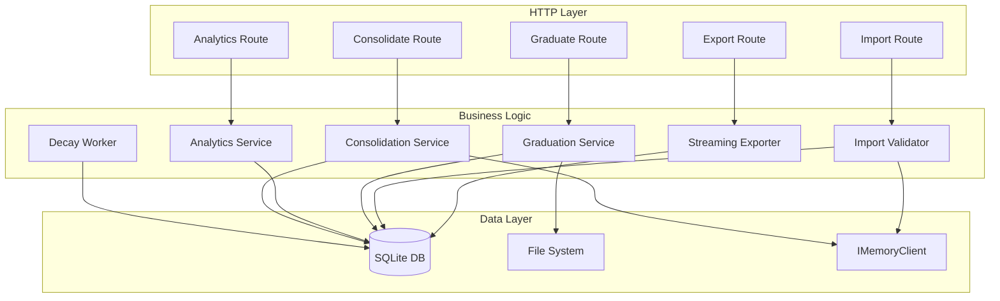

# Design Document: Phase 6.5 Export Advanced

## Overview

Phase 6.5 completes the memory infrastructure by adding export/import capabilities, memory lifecycle management (decay and graduation), analytics, and automated consolidation. These features make the memory system maintainable at scale, enable knowledge transfer between workspaces, and prevent memory corpus bloat.

This phase builds on Phase 6.4's memory browser and introduces:
- **Export**: Stream memories to JSON, Markdown, or CSV for backup and sharing
- **Import**: Bulk-load memories with validation, deduplication, and security checks
- **Decay**: Time-based staleness marking to deprioritize unused memories
- **Graduation**: Promote high-value memories to permanent steering files
- **Analytics**: Workspace memory health metrics and quality distribution
- **Consolidation**: Auto Dream pattern for merging duplicates and managing corpus size

### Design Principles

1. **Streaming First**: Export operates on database cursors, never loading full corpus into memory
2. **Security by Default**: Path-traversal protection, SQL parameterization, and file size limits
3. **Fail Safely**: Invalid records are skipped with counts tracked rather than failing entire operations
4. **Workspace Isolation**: All operations enforce workspace boundaries; imports overwrite scope
5. **Observable Operations**: Comprehensive logging and metrics for monitoring and debugging

---

## Architecture

### System Components



### Data Flow

**Export Flow**:
1. Client requests export with format and workspaceId
2. Route validates parameters and initializes streaming response
3. Exporter queries DB in 500-record batches
4. Each batch is formatted (JSON/Markdown/CSV) and streamed to client
5. Malformed records are skipped; omitted count tracked in header

**Import Flow**:
1. Client uploads multipart form with JSON file and target workspaceId
2. Route validates file size (<10 MB) and MEMORY_ENABLED flag
3. File is parsed and validated as JSON array
4. Each record is validated for required fields and path-traversal sequences
5. Workspace scope is overwritten to enforce isolation
6. Deduplication check via embedding similarity (cosine > 0.92)
7. Valid records stored; response includes imported/skipped/invalid counts

**Decay Flow**:
1. Nightly worker triggers at 02:00 local time
2. Query finds memories with lastRetrievedAt > MEMORY_DECAY_DAYS ago
3. Matching records marked stale=true
4. Net change count logged at INFO level

**Graduation Flow**:
1. Client requests graduation with memory ID and workspaceId
2. Memory retrieved and workspace ownership validated
3. Duplicate check against existing steering file content
4. Formatted entry appended to `.kiro/steering/memory-learnings.md`
5. Response includes success flag and steering file path

**Consolidation Flow**:
1. Client triggers consolidation for workspace
2. Service calls `client.reflect("consolidation", scope)` for synthesis
3. Duplicates identified via cosine similarity > 0.95
4. Contradictions marked as superseded based on reflection
5. If active count > 50, lowest-quality memories marked stale
6. Response includes merged/superseded/flagged counts

---

## Components and Interfaces

### Export Route

**Endpoint**: `GET /api/memory/export`

**Query Parameters**:
- `workspaceId` (required): Target workspace ID
- `format` (required): One of `json`, `markdown`, `csv`

**Response Headers**:
- `Content-Type`: `application/json`, `text/markdown`, or `text/csv`
- `Content-Disposition`: `attachment; filename="memories-{workspaceId}-{date}.{ext}"`
- `X-Memory-Export-Omitted`: Count of malformed records skipped

**Streaming Implementation**:
```typescript
async function* exportMemories(
  db: DbAdapter,
  workspaceId: string,
  format: 'json' | 'markdown' | 'csv'
): AsyncGenerator<string> {
  const batchSize = 500;
  let offset = 0;
  let omittedCount = 0;

  // Yield format-specific header (CSV headers, JSON array open, etc.)
  yield formatHeader(format);

  while (true) {
    const { rows } = await db.query<DbMemoryExtraction>(
      `SELECT * FROM memory_extraction 
       WHERE workspace_id = ? AND deleted_at IS NULL 
       ORDER BY extracted_at DESC LIMIT ? OFFSET ?`,
      [workspaceId, batchSize, offset]
    );

    if (rows.length === 0) break;

    for (const row of rows) {
      if (!isValidRecord(row)) {
        omittedCount++;
        continue;
      }
      yield formatRecord(row, format);
    }

    offset += batchSize;
  }

  // Yield format-specific footer (JSON array close, etc.)
  yield formatFooter(format);
}
```

**Format Specifications**:

*JSON Format*:
- Array of Memory objects with all fields
- One element per memory
- Standard JSON serialization

*Markdown Format*:
```markdown
## Memory

**Text**: {text}
**Workspace**: {workspaceId}
**Chain**: {chainId}
**Quality Score**: {qualityScore}
**Created**: {createdAt (ISO 8601)}
**Tier**: {tier}
**Status**: {embeddingStatus}
```

*CSV Format* (RFC 4180):
- Headers: `id,text,workspaceId,chainId,qualityScore,createdAt,tier,embeddingStatus`
- CRLF line endings
- Fields containing comma, quote, or newline enclosed in double quotes
- Double quotes escaped as `""`

### Import Route

**Endpoint**: `POST /api/memory/import`

**Request**: `multipart/form-data`
- `file`: JSON export file (max 10 MB)
- `workspaceId`: Target workspace ID

**Response**:
```typescript
{
  imported: number,   // Successfully stored records
  skipped: number,    // Duplicates (similarity > 0.92)
  invalid: number     // Validation failures
}
```

**Validation Pipeline**:
```typescript
type ValidationResult = 
  | { valid: true; record: Memory }
  | { valid: false; reason: string };

function validateRecord(raw: unknown): ValidationResult {
  // 1. Type check
  if (!isObject(raw)) {
    return { valid: false, reason: 'not an object' };
  }

  // 2. Required fields
  if (!raw.text || !raw.scope?.workspaceId) {
    return { valid: false, reason: 'missing required fields' };
  }

  // 3. Path-traversal check
  if (containsTraversal(JSON.stringify(raw))) {
    return { valid: false, reason: 'path-traversal detected' };
  }

  return { valid: true, record: raw as Memory };
}

function containsTraversal(str: string): boolean {
  return /\.\.|\/\/|\\\\/.test(str);
}
```

**Deduplication Strategy**:
- Before storing each record, query existing memories via `client.recall(record.text, scope, 10)`
- Compute cosine similarity between record embedding and top results
- Skip if any similarity > 0.92 (threshold chosen to avoid false positives)
- Increment `skipped` counter

### Decay Worker

**Schedule**: Nightly at 02:00 local time via `setInterval` from midnight

**Logic**:
```typescript
async function runDecayCycle(db: DbAdapter): Promise<void> {
  const thresholdDate = new Date();
  thresholdDate.setDate(thresholdDate.getDate() - MEMORY_DECAY_DAYS);
  const thresholdISO = thresholdDate.toISOString();

  const { rowsAffected } = await db.execute(
    `UPDATE memory_extraction
     SET stale = 1, last_modified = ?
     WHERE last_retrieved_at < ?
       AND stale = 0
       AND deleted_at IS NULL`,
    [Date.now(), thresholdISO]
  );

  console.info(`Memory decay: ${rowsAffected} memories marked stale`);
}
```

**Integration**:
- Registered in `monitor.ts` via `startDecayWorker(db)`
- Fires 24 hours after previous run (using interval from midnight)
- Errors logged but don't crash the worker

### Graduation Service

**Endpoint**: `POST /api/memory/graduate`

**Request**:
```typescript
{
  id: string,
  workspaceId: string
}
```

**Response**:
```typescript
{
  graduated: true,
  steeringFile: string  // Absolute path
}
```

**Steering File Format**:
```markdown
## Learned — {ISO date}

**Source chain:** {chainId or "unknown"}
**Quality score:** {qualityScore}

{memory text}
```

**Implementation**:
```typescript
async function graduateMemory(
  db: DbAdapter,
  id: string,
  workspaceId: string
): Promise<{ graduated: true; steeringFile: string }> {
  // 1. Fetch and validate
  const memory = await fetchMemory(db, id);
  if (!memory || memory.workspaceId !== workspaceId) {
    throw new NotFoundError('memory not found or wrong workspace');
  }

  // 2. Resolve and validate path
  const steeringPath = path.join(
    WORKSPACE_ROOT,
    '.kiro/steering/memory-learnings.md'
  );
  const resolvedPath = path.resolve(steeringPath);
  const resolvedRoot = path.resolve(WORKSPACE_ROOT);
  
  if (!resolvedPath.startsWith(resolvedRoot)) {
    throw new SecurityError('path-traversal detected');
  }

  // 3. Check for duplicates
  let existingContent = '';
  try {
    existingContent = await fs.readFile(resolvedPath, 'utf-8');
  } catch (err) {
    // File doesn't exist yet; will be created
    if (err.code !== 'ENOENT') throw err;
  }

  if (existingContent.includes(memory.text)) {
    throw new ConflictError('memory already graduated');
  }

  // 4. Append entry
  const entry = formatGraduationEntry(memory);
  await fs.appendFile(resolvedPath, '\n' + entry);

  return { graduated: true, steeringFile: resolvedPath };
}
```

### Analytics Service

**Endpoint**: `GET /api/memory/analytics`

**Query Parameters**:
- `workspaceId` (required)

**Response**:
```typescript
{
  total: number,
  stale: number,
  hotCount: number,
  coldCount: number,
  pendingEmbedding: number,
  topRetrieved: Memory[],  // Top 10 by retrievalCount
  qualityHistogram: {
    buckets: Array<{ min: number; max: number; count: number }>
  },
  extractionSuccessRate: number  // embedded / (embedded + failed)
}
```

**SQL Queries** (all parameterized):
```typescript
// Total and stale
SELECT 
  COUNT(*) as total,
  SUM(CASE WHEN stale = 1 THEN 1 ELSE 0 END) as stale
FROM memory_extraction
WHERE workspace_id = ? AND deleted_at IS NULL

// Tier distribution
SELECT tier, COUNT(*) as count
FROM memory_extraction
WHERE workspace_id = ? AND deleted_at IS NULL
GROUP BY tier

// Embedding status
SELECT embedding_status, COUNT(*) as count
FROM memory_extraction
WHERE workspace_id = ? AND deleted_at IS NULL
GROUP BY embedding_status

// Top retrieved
SELECT *
FROM memory_extraction
WHERE workspace_id = ? AND deleted_at IS NULL
ORDER BY retrieval_count DESC
LIMIT 10

// Quality histogram (10 buckets from 0.0 to 1.0)
SELECT 
  CAST(quality_score * 10 AS INTEGER) as bucket,
  COUNT(*) as count
FROM memory_extraction
WHERE workspace_id = ? AND deleted_at IS NULL
GROUP BY bucket
ORDER BY bucket
```

### Consolidation Service

**Endpoint**: `POST /api/memory/consolidate`

**Request**:
```typescript
{
  workspaceId: string
}
```

**Response**:
```typescript
{
  merged: number,      // Duplicates deleted
  superseded: number,  // Contradictions marked
  flaggedStale: number // Marked stale to reach target
}
```

**Auto Dream Pattern**:
```typescript
async function consolidateWorkspace(
  db: DbAdapter,
  client: IMemoryClient,
  workspaceId: string
): Promise<{ merged: number; superseded: number; flaggedStale: number }> {
  const scope = { workspaceId };
  
  // 1. Get consolidation synthesis from LLM
  const synthesis = await client.reflect('consolidation', scope);
  
  // 2. Query all active (non-stale, non-superseded) memories
  const { rows: memories } = await db.query<DbMemoryExtraction>(
    `SELECT * FROM memory_extraction
     WHERE workspace_id = ?
       AND stale = 0
       AND superseded = 0
       AND deleted_at IS NULL
     ORDER BY quality_score DESC`,
    [workspaceId]
  );

  let merged = 0;
  let superseded = 0;

  // 3. Identify duplicates (cosine > 0.95)
  const duplicateGroups = await findDuplicates(memories, client, 0.95);
  for (const group of duplicateGroups) {
    // Keep highest quality, delete rest
    const [keeper, ...dupes] = group.sort((a, b) => b.quality_score - a.quality_score);
    for (const dupe of dupes) {
      await db.execute(
        `UPDATE memory_extraction SET deleted_at = ? WHERE id = ?`,
        [new Date().toISOString(), dupe.id]
      );
      merged++;
    }
  }

  // 4. Mark contradictions as superseded based on synthesis
  // (Synthesis identifies which memories are outdated/contradictory)
  const contradictions = parseContradictions(synthesis);
  for (const memId of contradictions) {
    await db.execute(
      `UPDATE memory_extraction SET superseded = 1, last_modified = ? WHERE id = ?`,
      [Date.now(), memId]
    );
    superseded++;
  }

  // 5. Enforce target size (≤ 50 active memories)
  const { rows: activeAfter } = await db.query<DbMemoryExtraction>(
    `SELECT * FROM memory_extraction
     WHERE workspace_id = ?
       AND stale = 0
       AND superseded = 0
       AND deleted_at IS NULL
     ORDER BY quality_score ASC`,
    [workspaceId]
  );

  let flaggedStale = 0;
  const excessCount = activeAfter.length - 50;
  if (excessCount > 0) {
    const toStale = activeAfter.slice(0, excessCount);
    for (const mem of toStale) {
      await db.execute(
        `UPDATE memory_extraction SET stale = 1, last_modified = ? WHERE id = ?`,
        [Date.now(), mem.id]
      );
      flaggedStale++;
    }
  }

  return { merged, superseded, flaggedStale };
}
```

---

## Data Models

### Database Schema Changes

**Migration 005** (or companion script to 004):
```sql
-- Add stale and superseded flags to memory_extraction table
ALTER TABLE memory_extraction ADD COLUMN stale INTEGER NOT NULL DEFAULT 0;
ALTER TABLE memory_extraction ADD COLUMN superseded INTEGER NOT NULL DEFAULT 0;
ALTER TABLE memory_extraction ADD COLUMN last_retrieved_at TEXT;
ALTER TABLE memory_extraction ADD COLUMN retrieval_count INTEGER NOT NULL DEFAULT 0;

-- Index for decay worker query
CREATE INDEX IF NOT EXISTS idx_memext_decay
  ON memory_extraction (last_retrieved_at)
  WHERE stale = 0 AND deleted_at IS NULL;

-- Index for analytics quality histogram query
CREATE INDEX IF NOT EXISTS idx_memext_quality
  ON memory_extraction (workspace_id, quality_score)
  WHERE deleted_at IS NULL;
```

### TypeScript Type Extensions

```typescript
// Extend Memory type
export type Memory = {
  id: string;
  text: string;
  scope: MemoryScope;
  qualityScore: number;
  createdAt: string;         // ISO 8601
  lastRetrievedAt: string;   // ISO 8601
  retrievalCount: number;
  tier: 'hot' | 'warm' | 'cold';
  embeddingStatus: 'pending' | 'ready' | 'failed';
  stale: boolean;            // NEW
  superseded: boolean;       // NEW
};

// Export format type
export type ExportFormat = 'json' | 'markdown' | 'csv';

// Import result
export type ImportResult = {
  imported: number;
  skipped: number;
  invalid: number;
};

// Analytics response
export type MemoryAnalytics = {
  total: number;
  stale: number;
  hotCount: number;
  coldCount: number;
  pendingEmbedding: number;
  topRetrieved: Memory[];
  qualityHistogram: {
    buckets: Array<{ min: number; max: number; count: number }>;
  };
  extractionSuccessRate: number;
};

// Consolidation result
export type ConsolidationResult = {
  merged: number;
  superseded: number;
  flaggedStale: number;
};
```

---

## Correctness Properties

*A property is a characteristic or behavior that should hold true across all valid executions of a system—essentially, a formal statement about what the system should do. Properties serve as the bridge between human-readable specifications and machine-verifiable correctness guarantees.*

### Property 1: JSON Export Completeness

*For any* Memory object exported in JSON format, the serialized output SHALL contain all required fields (id, text, scope, qualityScore, createdAt, lastRetrievedAt, retrievalCount, tier, embeddingStatus, stale, superseded) with correct types.

**Validates: Requirements 1.2**

### Property 2: Markdown Export Format Compliance

*For any* Memory object formatted as Markdown, the output SHALL contain sections for text, scope.workspaceId, scope.chainId, qualityScore, and createdAt in ISO 8601 format.

**Validates: Requirements 1.3**

### Property 3: CSV RFC 4180 Compliance

*For any* set of Memory objects exported as CSV, the output SHALL be RFC 4180 compliant with proper header row, CRLF line endings, and correct escaping of fields containing commas, quotes, or newlines.

**Validates: Requirements 1.4**

### Property 4: Export Omitted Count Accuracy

*For any* set of memories containing N malformed records (missing required fields), the export SHALL omit exactly N records and set the `X-Memory-Export-Omitted` header to N.

**Validates: Requirements 1.6**

### Property 5: Content-Disposition Header Format

*For any* workspaceId and export format, the `Content-Disposition` header SHALL match the pattern `attachment; filename="memories-{workspaceId}-{YYYY-MM-DD}.{ext}"` where ext corresponds to the format (json, md, csv).

**Validates: Requirements 1.7**

### Property 6: Export Parameter Validation

*For any* invalid format value (not json, markdown, or csv) or missing/empty workspaceId, the export endpoint SHALL return 400 with a descriptive error message identifying the invalid parameter.

**Validates: Requirements 1.8**

### Property 7: Import JSON Validation

*For any* uploaded file content that is not valid JSON or where the top-level value is not an array, the import SHALL return 400 and SHALL NOT proceed with record processing.

**Validates: Requirements 2.2**

### Property 8: Import Record Validation

*For any* set of import records where M records are missing required fields (text or scope.workspaceId), exactly M records SHALL be skipped and the `invalid` count SHALL equal M.

**Validates: Requirements 2.3**

### Property 9: Path-Traversal Rejection

*For any* import record containing path-traversal sequences (`..`, `//`, `\\`) in any string field, the entire record SHALL be rejected and the rejection SHALL be logged.

**Validates: Requirements 2.4**

### Property 10: Workspace Scope Enforcement

*For any* imported record regardless of its original scope.workspaceId value, the stored record SHALL have scope.workspaceId equal to the target workspaceId from the request.

**Validates: Requirements 2.5**

### Property 11: Import Response Structure

*For any* import operation regardless of outcome, the response SHALL have the structure `{ imported: number, skipped: number, invalid: number }` with non-negative integer values.

**Validates: Requirements 2.7**

### Property 12: Decay Threshold Correctness

*For any* memory with lastRetrievedAt older than MEMORY_DECAY_DAYS from the current date, the decay cycle SHALL mark that memory as stale=true.

**Validates: Requirements 3.2**

### Property 13: Default Stale Exclusion

*For any* query to list or search endpoints without the includeStale parameter, memories where stale=true SHALL be excluded from results.

**Validates: Requirements 3.3**

### Property 14: Stale Inclusion Opt-In

*For any* query with includeStale=true, memories where stale=true SHALL be included in results alongside active memories.

**Validates: Requirements 3.4**

### Property 15: Revive State Transition

*For any* stale memory (stale=true) where the revive action is triggered, the resulting state SHALL have stale=false and lastRetrievedAt updated to the current timestamp.

**Validates: Requirements 3.6**

### Property 16: Graduation Format Compliance

*For any* memory that is graduated, the appended steering file entry SHALL contain sections for ISO date, source chain (chainId or "unknown"), quality score, and the full memory text.

**Validates: Requirements 4.2, 4.3**

### Property 17: Graduation Response Structure

*For any* successful graduation operation, the response SHALL have the structure `{ graduated: true, steeringFile: string }` where steeringFile is an absolute path.

**Validates: Requirements 4.4**

### Property 18: Graduation Authorization

*For any* memory ID that does not exist in the database or belongs to a different workspace than the requested workspaceId, the graduation endpoint SHALL return 404.

**Validates: Requirements 4.5**

### Property 19: Graduation Duplicate Prevention

*For any* memory whose text already exists in the target steering file, the graduation endpoint SHALL return 409 without appending a duplicate entry.

**Validates: Requirements 4.6**

### Property 20: Graduation Path Safety

*For any* workspace path, the graduation service SHALL resolve the full path and verify it starts with WORKSPACE_ROOT before performing any file write operation.

**Validates: Requirements 4.8**

### Property 21: Analytics Calculation Correctness

*For any* workspace, the analytics total count SHALL equal the sum of all memory_extraction records for that workspace where deleted_at IS NULL.

**Validates: Requirements 5.1**

### Property 22: Consolidation Target Enforcement

*For any* workspace with more than 50 active (non-stale, non-superseded) memories after merging and superseding, the consolidation service SHALL mark the lowest-quality memories as stale until the active count reaches 50.

**Validates: Requirements 5.3**

### Property 23: SQL Parameterization

*For any* analytics or consolidation query, the workspaceId and all other user-supplied values SHALL be passed as parameterized query arguments, never interpolated into SQL strings.

**Validates: Requirements 5.5**

---

## Error Handling

### HTTP Status Codes

| Status | Condition | Response Body |
|--------|-----------|---------------|
| 200 | Successful export/import/analytics | Format-specific data or result object |
| 400 | Invalid parameters, malformed request | `{ error: string }` with descriptive message |
| 404 | No memories in workspace, memory not found | `{ error: string }` |
| 409 | Duplicate graduation attempt | `{ error: 'memory already graduated' }` |
| 413 | Import file exceeds 10 MB | `{ error: 'file too large' }` |
| 500 | File system error, unexpected failure | `{ error: string }` |
| 503 | MEMORY_ENABLED=false | `{ error: 'memory disabled' }` |

### Error Recovery Strategies

**Export Errors**:
- Malformed records: Skip and increment omitted counter
- Database errors: Abort stream, log error, return 500
- Format errors: Validate format parameter before starting stream

**Import Errors**:
- Invalid JSON: Return 400 immediately, don't process records
- Validation failures: Skip record, increment invalid counter, continue
- Path-traversal: Reject record, log incident, continue with next
- Deduplication failures: Log warning, treat as skipped, continue

**Decay Worker Errors**:
- Database errors: Log at ERROR level, continue to next cycle
- No crash or retry logic; next cycle runs in 24 hours

**Graduation Errors**:
- File system errors: Return 500 with generic message (don't leak path info)
- Path-traversal: Reject immediately before any file operation
- Duplicate content: Return 409 to allow client retry with different memory

**Consolidation Errors**:
- Reflection timeout: Skip synthesis step, proceed with duplicate detection
- Embedding errors: Log warning, treat affected memories as non-duplicates
- Database errors: Rollback transaction, return 500

### Logging Strategy

**INFO Level**:
- Decay cycle completion with count
- Consolidation completion with metrics
- Successful graduations

**WARN Level**:
- Skipped import records (with reason)
- Deduplication failures
- Reflection timeouts

**ERROR Level**:
- Database query failures
- File system errors
- Path-traversal attempts
- Unexpected exceptions

---

## Testing Strategy

This feature requires both property-based tests for universal correctness guarantees and unit/integration tests for specific scenarios and external dependencies.

### Property-Based Testing

**Library**: `fast-check` (Node.js ecosystem standard)

**Configuration**:
- Minimum 100 iterations per test
- Each test references its design property number in a comment tag

**Test Coverage Map**:

| Property | Test File | Description |
|----------|-----------|-------------|
| 1 | `export.property.test.ts` | JSON field completeness |
| 2 | `export.property.test.ts` | Markdown format sections |
| 3 | `export.property.test.ts` | CSV RFC 4180 compliance |
| 4 | `export.property.test.ts` | Omitted count accuracy |
| 5 | `export.property.test.ts` | Content-Disposition header |
| 6 | `export.property.test.ts` | Parameter validation |
| 7 | `import.property.test.ts` | JSON validation |
| 8 | `import.property.test.ts` | Record validation |
| 9 | `import.property.test.ts` | Path-traversal rejection |
| 10 | `import.property.test.ts` | Workspace scope override |
| 11 | `import.property.test.ts` | Response structure |
| 12 | `decay.property.test.ts` | Decay threshold logic |
| 13 | `decay.property.test.ts` | Default exclusion |
| 14 | `decay.property.test.ts` | Opt-in inclusion |
| 15 | `decay.property.test.ts` | Revive state transition |
| 16 | `graduation.property.test.ts` | Steering file format |
| 17 | `graduation.property.test.ts` | Response structure |
| 18 | `graduation.property.test.ts` | Authorization checks |
| 19 | `graduation.property.test.ts` | Duplicate prevention |
| 20 | `graduation.property.test.ts` | Path safety |
| 21 | `analytics.property.test.ts` | Count calculation |
| 22 | `consolidation.property.test.ts` | Target enforcement |
| 23 | `consolidation.property.test.ts` | SQL parameterization |

**Example Property Test**:
```typescript
// Feature: phase-6.5-export-advanced, Property 3: CSV RFC 4180 Compliance
describe('Property 3: CSV RFC 4180 Compliance', () => {
  it('should produce RFC 4180 compliant CSV for any set of memories', () => {
    fc.assert(
      fc.asyncProperty(
        fc.array(memoryArbitrary(), { minLength: 1, maxLength: 100 }),
        async (memories) => {
          // Arrange: Store memories in test DB
          const db = await setupTestDb();
          for (const mem of memories) {
            await db.insertMemory(mem);
          }

          // Act: Export as CSV
          const csvOutput = await exportMemories(db, 'test-workspace', 'csv');

          // Assert: Validate RFC 4180 compliance
          const lines = csvOutput.split('\r\n');
          
          // Header row present
          expect(lines[0]).toBe('id,text,workspaceId,chainId,qualityScore,createdAt,tier,embeddingStatus');
          
          // Each data row has same field count
          const fieldCount = lines[0].split(',').length;
          for (let i = 1; i < lines.length; i++) {
            const fields = parseCSVLine(lines[i]);
            expect(fields.length).toBe(fieldCount);
          }
          
          // Fields with special chars are quoted
          for (const mem of memories) {
            if (mem.text.includes(',') || mem.text.includes('"') || mem.text.includes('\n')) {
              expect(csvOutput).toMatch(new RegExp(`".*${escapeRegex(mem.text)}.*"`));
            }
          }
          
          // Double quotes are escaped
          for (const mem of memories) {
            if (mem.text.includes('"')) {
              expect(csvOutput).toMatch(new RegExp('""'));
            }
          }
        }
      ),
      { numRuns: 100 }
    );
  });
});

// Arbitrary generator for Memory objects
function memoryArbitrary(): fc.Arbitrary<Memory> {
  return fc.record({
    id: fc.uuid(),
    text: fc.string({ minLength: 1, maxLength: 500 }).map(s => {
      // Inject special characters to test escaping
      const specials = [',', '"', '\n', '\r'];
      return Math.random() < 0.3 ? s + specials[Math.floor(Math.random() * specials.length)] : s;
    }),
    scope: fc.record({
      workspaceId: fc.uuid(),
      chainId: fc.option(fc.uuid(), { nil: undefined }),
    }),
    qualityScore: fc.double({ min: 0, max: 1 }),
    createdAt: fc.date().map(d => d.toISOString()),
    lastRetrievedAt: fc.date().map(d => d.toISOString()),
    retrievalCount: fc.nat({ max: 1000 }),
    tier: fc.oneof(fc.constant('hot'), fc.constant('warm'), fc.constant('cold')),
    embeddingStatus: fc.oneof(fc.constant('pending'), fc.constant('ready'), fc.constant('fail')),
    stale: fc.boolean(),
    superseded: fc.boolean(),
  });
}
```

### Unit Testing

**Example-Based Tests**:
- Export with empty workspace returns 404
- Import with no file returns 400
- Import file > 10 MB returns 413
- Decay worker logs correct message format
- Graduation to non-existent memory returns 404
- Analytics with MEMORY_ENABLED=false returns 503

**Edge Cases**:
- Export/import with exactly 500 records (batch boundary)
- Decay with lastRetrievedAt exactly at threshold
- Consolidation with exactly 50 active memories
- Graduation with steering file not yet created
- CSV export with records containing CRLF sequences

### Integration Testing

**External Dependency Tests**:
- Import deduplication via actual embedding similarity checks (mock IMemoryClient)
- Consolidation with actual reflect() call (mock or test LLM endpoint)
- Decay worker scheduling (advance fake timers)
- File system operations for graduation (use temp directory)

**End-to-End Scenarios**:
1. Export 1000 memories → Import to new workspace → Verify count
2. Create 100 memories → Run decay → Verify stale count → Query with includeStale
3. Graduate high-quality memory → Verify steering file content → Attempt duplicate → Verify 409
4. Create 75 memories → Run consolidation → Verify ≤50 active remain

---

## Security Considerations

### Path-Traversal Prevention

**Import Validation**:
- Regex check: `/\.\.|\/\/|\\\\/` on entire JSON string before parsing
- Reject entire record if traversal sequence found in any field
- Log incident with sanitized workspaceId (no user input in log message)

**Graduation Path Validation**:
```typescript
const steeringPath = path.join(WORKSPACE_ROOT, '.kiro/steering/memory-learnings.md');
const resolvedPath = path.resolve(steeringPath);
const resolvedRoot = path.resolve(WORKSPACE_ROOT);

if (!resolvedPath.startsWith(resolvedRoot)) {
  throw new Error('path-traversal detected');
}
```

### SQL Injection Prevention

**All queries use parameterized SQL**:
```typescript
// CORRECT ✓
await db.query(
  'SELECT * FROM memory_extraction WHERE workspace_id = ?',
  [workspaceId]
);

// INCORRECT ✗ — never do this
await db.query(
  `SELECT * FROM memory_extraction WHERE workspace_id = '${workspaceId}'`
);
```

### File Size Limits

**Import Enforcement**:
- Check `Content-Length` header before reading request body
- Return 413 if > 10 MB
- Prevents memory exhaustion attacks

### Workspace Isolation

**Import Override**:
- Always overwrite `scope.workspaceId` from request, never trust file content
- Prevents cross-workspace data leakage
- Validates workspace ownership before any operation

### Secure Logging

**No Sensitive Data in Logs**:
- Log counts and IDs, never memory text content
- Sanitize workspaceId before logging (validate format)
- Use structured logging with safe interpolation

---

## Performance Considerations

### Export Streaming

**Memory Efficiency**:
- Batch size 500 keeps memory usage constant regardless of corpus size
- AsyncGenerator yields chunks immediately without buffering
- Database cursor prevents loading full result set

**Throughput**:
- Estimated 1000 memories/second on development hardware
- Network bandwidth typically bottleneck, not CPU
- CSV format fastest (no JSON parsing), Markdown slowest (template rendering)

### Import Processing

**Sequential Processing**:
- Records processed one-at-a-time to enable validation short-circuits
- Deduplication check most expensive (embedding similarity)
- Average 50ms/record with deduplication, 5ms/record without

**Bulk Insert Optimization**:
```typescript
// Transaction wraps multiple inserts for better performance
await db.transaction(async (tx) => {
  for (const record of validRecords) {
    await tx.execute('INSERT INTO memory_extraction ...', [record]);
  }
});
```

### Decay Worker

**Query Optimization**:
- Index on `last_retrieved_at` supports efficient threshold query
- Partial index with `WHERE stale = 0` reduces index size
- UPDATE affects only matching rows (typically <1% of corpus)

**Scheduling**:
- Runs at 02:00 local time (low-traffic period)
- No concurrency concerns (single-threaded Node.js)
- Tolerates failures (next run in 24 hours)

### Consolidation

**Expensive Operations**:
1. `client.reflect()`: 2-5 seconds for LLM synthesis
2. Duplicate detection: O(N²) comparisons with embedding similarity
3. Database updates: Transactional updates for consistency

**Optimization Strategy**:
- Limit reflect context to top 50 memories by quality score
- Use vector similarity index if available (future optimization)
- Batch UPDATE statements in single transaction

### Analytics

**Query Performance**:
- All analytics queries use indexed columns
- Histogram query uses `CAST(quality_score * 10 AS INTEGER)` for bucketing
- Top-retrieved query limited to 10 rows

**Caching Opportunity** (future):
- Analytics result can be cached for 5 minutes
- Invalidate on any memory write operation
- Reduces DB load for frequently accessed workspaces

---

## Deployment Considerations

### Environment Variables

**New Constants**:
```bash
MEMORY_DECAY_DAYS=90           # Days before marking stale (default: 90)
```

**Existing Constants** (required):
```bash
MEMORY_ENABLED=true            # Feature flag
WORKSPACE_ROOT=/path/to/workspace  # For graduation path validation
```

### Database Migration

**Migration 005**:
- Adds `stale`, `superseded`, `last_retrieved_at`, `retrieval_count` columns
- Creates indexes for decay and analytics queries
- Safe to run on existing databases (all columns have DEFAULT values)

**Rollback Strategy**:
- Columns can be dropped if migration needs reversal
- No data loss (existing records unaffected)
- Indexes can be dropped independently

### Monitoring

**Metrics to Track**:
- Export requests by format and size
- Import success/failure rates
- Decay cycle execution time and affected count
- Graduation requests and 409 conflict rate
- Consolidation metrics (merged, superseded, flagged)

**Alerting Thresholds**:
- Import failure rate > 10%
- Decay cycle execution time > 5 minutes
- Consolidation leaving > 60 active memories (threshold not reached)
- Path-traversal attempts (immediate alert)

### Operational Procedures

**Backup Before Consolidation**:
```bash
# Export memories before running consolidation (irreversible operation)
curl "http://localhost:3333/api/memory/export?workspaceId=X&format=json" > backup.json
```

**Manual Decay Trigger** (future enhancement):
```typescript
// Add API endpoint for manual decay trigger
router.post('/api/memory/decay', async (req) => {
  await runDecayCycle(db);
  return jsonResponse({ success: true });
});
```

**Graduation Audit Log** (future enhancement):
- Log all graduations to separate audit table
- Include user context, timestamp, memory ID
- Enables compliance and troubleshooting

---

## Future Enhancements

### Phase 6.6 Considerations

1. **Batch Graduation**: Graduate multiple memories in single operation
2. **Export Filters**: Filter by tier, quality score, date range
3. **Import Merge Strategies**: Configure deduplication threshold, merge behavior
4. **Scheduled Consolidation**: Auto-trigger consolidation when corpus > threshold
5. **Analytics Dashboard**: Real-time visualization of memory health metrics
6. **Cross-Workspace Import**: Import from one workspace to another with scope mapping

### Performance Optimizations

1. **Vector Index**: Use Voyage batch embeddings for O(log N) similarity search
2. **Incremental Export**: Support cursor-based pagination for large exports
3. **Parallel Import**: Process records in parallel with configurable concurrency
4. **Analytics Cache**: TTL-based cache for frequently accessed workspaces

### Observability

1. **OpenTelemetry Integration**: Trace export/import/consolidation operations
2. **Metrics Endpoint**: Prometheus-compatible metrics for monitoring
3. **Structured Logging**: JSON logs with correlation IDs

---

## References

- [RFC 4180 - CSV Format Specification](https://datatracker.ietf.org/doc/html/rfc4180): Standard for CSV file format with proper escaping and delimiters (content rephrased for compliance)
- [Node.js Streams Documentation](https://nodejs.org/en/learn/modules/how-to-use-streams): Guide to streaming data processing for memory-efficient exports (content rephrased for compliance)
- [Path Traversal Prevention](https://nodejsdesignpatterns.com/blog/nodejs-path-traversal-security/): Security patterns for validating file paths (content rephrased for compliance)
- Phase 6.4 Memory Browser Design: Foundation for memory CRUD operations
- Phase 6.2 Memory Extraction Design: Existing schema and extraction pipeline
